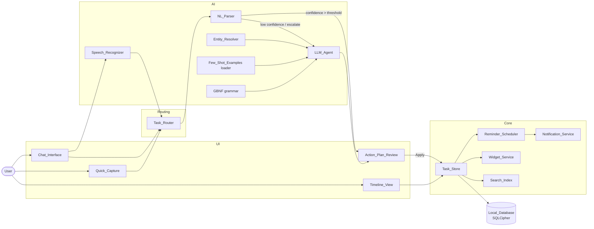
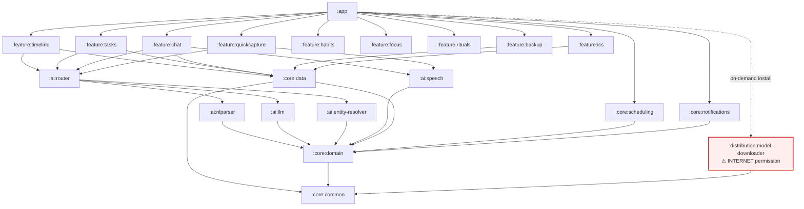
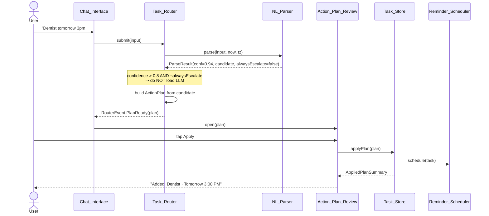
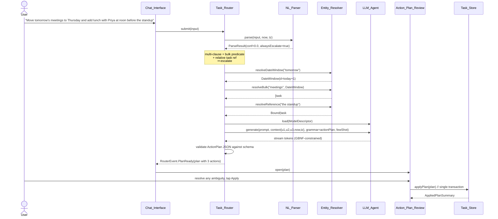
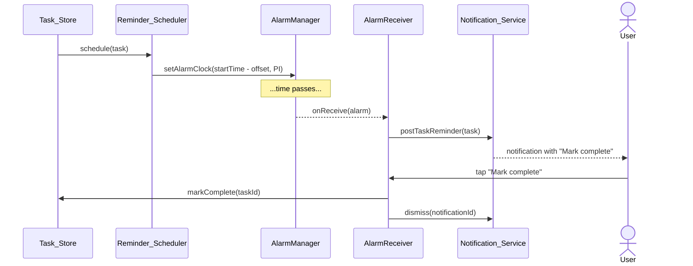
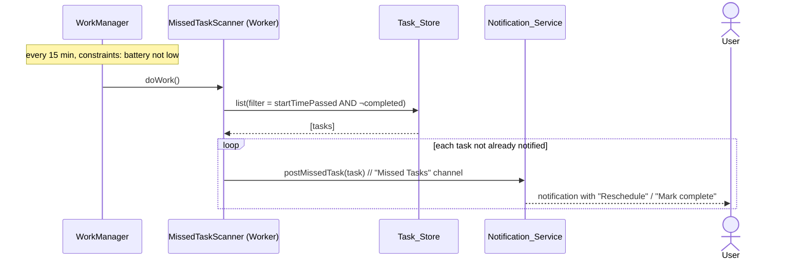
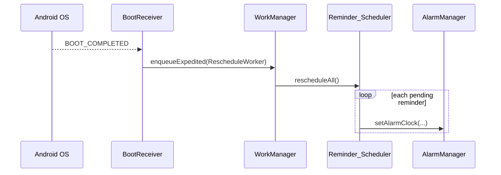
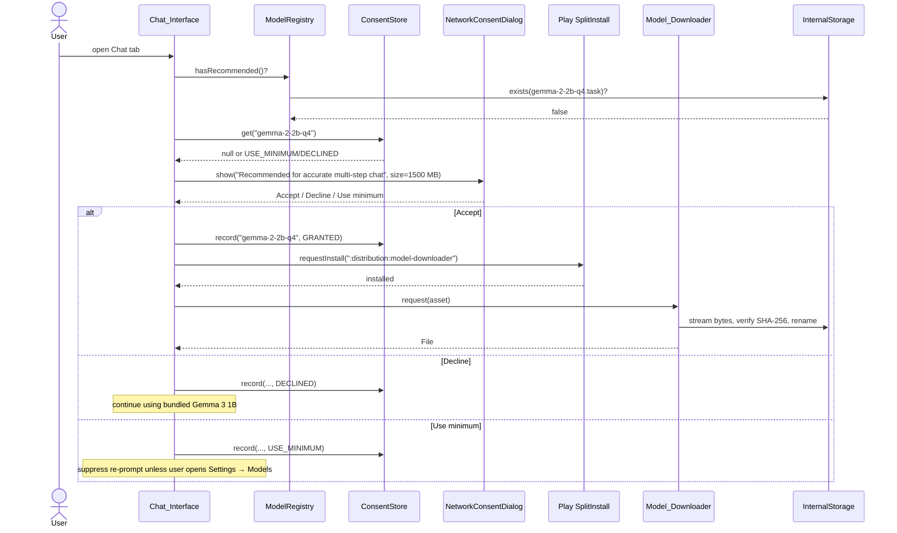

# Design Document

## 1. Overview and Design Principles

### 1.1 Problem recap

AI Daily Planner is a strictly offline-first Android application that combines a visual day timeline (Structured-style) with a richer productivity stack (tasks, habits, focus sessions, planning and shutdown rituals, quick capture, widgets, ICS import, encrypted backups) and an on-device LLM chat assistant. The assistant accepts typed or spoken natural language, but the user always sees and confirms an editable `Action_Plan_Review` before any data is mutated. No cloud path exists for inference, speech, search, analytics, telemetry, or crash reporting. The only network activity the application ever performs is a user-consented, one-time asset download through an isolated `Model_Downloader` module; everything else runs entirely on the device.

The reference performance device is the Samsung Galaxy S23 (Snapdragon 8 Gen 2, 8 GB RAM, Android 13+). All latency, cold-load, and RSS budgets are measured against that class of device. The reference model tier is Gemma 3 1B Q4_K_M (always bundled, ~0.8 GB) as the safe fallback, Gemma 2 2B Q4_K_M (~1.5 GB) as the recommended consented download, and a set of optional 3B–4B models for power users.

### 1.2 Guiding principles

1. **Offline-by-default, manifest-level enforced.** `android.permission.INTERNET` is declared only in the isolated `:distribution:model-downloader` dynamic feature module. The main `:app` manifest and every other module's manifest is free of it, enforced by a Gradle/CI check that fails the build if any non-downloader manifest adds it. A `SocketFactory` override installed at `Application.onCreate()` throws `SecurityException` on any socket created outside the downloader's execution context.
2. **Tiered NL routing: parser first, LLM last resort.** Every natural-language input flows through `Task_Router`. The deterministic `NL_Parser` is invoked first. Only when its confidence falls at or below 0.8, or the input matches an always-escalate pattern (multi-clause, bulk predicate, relative task reference, relative-to-task temporal reference — Req 25 AC 8), does the router load and invoke the `LLM_Agent`. This keeps the common case on the order of tens of milliseconds and the battery impact near zero.
3. **Lazy LLM lifecycle.** The model is not loaded at cold start. It is loaded on demand (`Chat_Interface` open, or router escalation), kept warm for a 60-second idle timeout after the last inference, and unloaded on timeout or `Chat_Interface` destruction. While unloaded, the process holds no native memory, GPU context, or wake locks attributable to inference (Req 7 AC 15–17, Req 23 AC 5).
4. **Grammar-constrained structured output.** The `LLM_Agent` emits `Action_Plan` JSON under a GBNF grammar passed to the MediaPipe LLM Inference runtime (with llama.cpp as an allowed alternate). Combined with deterministically selected few-shot examples, this makes structured output reliable without training on-device.
5. **On-device entity resolution, on-device everything.** The `Entity_Resolver` deterministically resolves bulk predicates ("all my meetings"), relative task references ("the standup"), relative date references ("tomorrow"), and relative-to-task temporal references ("before X") against the `Local_Database`. Resolution never touches the network.
6. **User-in-control via `Action_Plan_Review`.** The assistant never applies a schedule change autonomously. Every mutating plan is surfaced as an editable review form; the user applies, cancels, or saves as draft. Read-only idempotent actions may bypass review (Req 9 AC 3, Req 28 AC 1).
7. **Property-based testing of invariants.** The requirements document enumerates 23 correctness properties. Every one of them is implemented as a property-based test with at least 100 iterations. This drives the design toward small pure cores (`Recurrence_Engine`, `NL_Parser`, `Entity_Resolver`, `Action_Plan` validator, streak math, etc.) that test well on the JVM.
8. **Emulator-first dev loop.** Because the user cannot USB-tether the device and prefers not to test on device, the design puts the overwhelming majority of verification on the JVM and an Android Studio emulator. Real-device testing happens on Firebase Test Lab matrix runs per release candidate, and installable APKs reach the user's phone via Firebase App Distribution (no USB).

---

## 2. High-Level Architecture

### 2.1 Multi-module Gradle layout

The project is a multi-module Gradle build. Modules are split along two axes: (a) JVM vs Android dependency, so that as much logic as possible can be unit-tested on the JVM; (b) strict separation of the single module that carries `INTERNET`.

```
:app                              — entry point, navigation graph, DI wiring (Hilt), ApplicationClass, startup init
:core:common                      — pure Kotlin, no Android deps: time utilities, result types, hashing, JSON schema helper
:core:domain                      — pure Kotlin: entities (Task, Event, Habit, ...), Action_Plan schema, repository interfaces
:core:data                        — Room + SQLCipher DAOs, repository implementations, FTS5 search index, Keystore key provider
:core:scheduling                  — AlarmManager and WorkManager wrappers, Reminder_Scheduler
:core:notifications               — channel registration, Notification_Service, notification action receivers
:feature:timeline                 — Timeline_View composables, ViewModel, day-and-week rendering
:feature:tasks                    — task editor, detail, subtasks, recurrence picker
:feature:chat                     — Chat_Interface, Action_Plan_Review, conversation list
:feature:quickcapture             — Quick_Capture notification, Sharesheet intent, widget entry point
:feature:habits                   — Habit_Tracker UI and streak math (phase-gated, Phase 6)
:feature:focus                    — Focus_Session_Manager and foreground service (phase-gated, Phase 6)
:feature:rituals                  — Planning_Ritual and Shutdown_Ritual workflows (phase-gated, Phase 6)
:feature:backup                   — Backup_Manager export/import UI and file I/O (phase-gated, Phase 6)
:feature:ics                      — ICS_Importer UI and document picker (phase-gated, Phase 6)
:ai:router                        — Task_Router, escalation policy, routing metrics
:ai:nlparser                      — deterministic NL_Parser, pretty printer, confidence scorer
:ai:llm                           — LLM_Agent, MediaPipe adapter, llama.cpp JNI adapter, grammar, few-shot loader
:ai:entity-resolver               — Entity_Resolver rules engine and predicate registry
:ai:speech                        — Speech_Recognizer interface, whisper.cpp JNI impl, Android SpeechRecognizer adapter
:distribution:model-downloader    — the ONLY module with android.permission.INTERNET; dynamic feature module
:macrobenchmark                   — Macrobenchmark module for startup, Timeline render, LLM first-token
```

Every module except `:distribution:model-downloader`, `:app`, and the `:feature:*` modules has zero Android framework dependencies in its `main` source set where possible. Tests live as `test` (JVM) for pure-Kotlin modules and as `test` plus `androidTest` for Android modules.

**Android identity.**

- `applicationId`: `dev.aetheris.planner`
- Base Kotlin namespace: `dev.aetheris.planner` with per-module sub-namespaces — e.g. `dev.aetheris.planner.app`, `dev.aetheris.planner.core.data`, `dev.aetheris.planner.ai.llm`, `dev.aetheris.planner.distribution.modeldownloader`.
- Launcher label: "Aetheris Planner" (string resource `R.string.app_name`, localized).
- Release keystore alias: `aetheris-release` — also the Google Play upload-key alias once Phase 7 enrolls the app in Google Play App Signing (§12.1.B1, Req 29 AC 12).

### 2.2 Component flow diagram



Key invariants visible in the diagram:

- `Task_Router` is the single code path that can invoke `LLM_Agent` for creation, update, or deletion (Req 25 AC 7).
- `Action_Plan_Review` is the single code path that commits mutating `Action_Plans` to `Task_Store` (Req 28 AC 1, 7).
- `Entity_Resolver` runs before the `LLM_Agent` and feeds it UUIDs, never free-text names (Req 27 AC 6).

### 2.3 Module-dependency diagram



The only module with `android.permission.INTERNET` is `:distribution:model-downloader`, and `:app` depends on it only via on-demand installation (Play Feature Delivery). The downloader has no reverse dependency on feature modules; it exposes a narrow interface (`Model_Downloader.request(asset, progress)`) that callers invoke after consent is recorded.

### 2.4 Manifest and permission strategy (Req 5 AC 8)

- `:app/src/main/AndroidManifest.xml` — **no `android.permission.INTERNET`**. It declares only the permissions the offline surfaces need: `POST_NOTIFICATIONS`, `SCHEDULE_EXACT_ALARM`, `USE_EXACT_ALARM` (API 33+), `RECEIVE_BOOT_COMPLETED`, `RECORD_AUDIO` (requested just-in-time), `FOREGROUND_SERVICE`, `FOREGROUND_SERVICE_SPECIAL_USE` for focus sessions, and `READ_MEDIA_AUDIO` only if voice features need it (they do not — audio is captured not read from storage).
- `:distribution:model-downloader/src/main/AndroidManifest.xml` — declares `android.permission.INTERNET`. Delivered as a `dynamicFeature` module, installed on-demand via the Play Core SplitInstall API the first time a consented download is requested. Until the user accepts a `Network_Consent_Dialog`, the module is not installed and cannot open sockets because its code is not present in the process.
- **Manifest lint gate.** A custom Gradle task `:buildSrc:checkManifests` runs at `preBuild` and fails the build if `INTERNET` appears in any manifest file under the project other than `:distribution:model-downloader`. Implementation: a text scan (`Regex("""android\.permission\.INTERNET""")`) over every `*AndroidManifest.xml` file in the Gradle settings, skipping the allow-listed path. The custom task is wired into `./gradlew check` so CI fails early.
- **Runtime `SocketFactory` override.** `Application.onCreate()` installs a replacement `SocketFactory` and `SSLSocketFactory` via reflection on `Socket.setSocketImplFactory` and on `HttpsURLConnection.setDefaultSSLSocketFactory`, and additionally sets `java.net.Authenticator` to one that throws. The replacement inspects the current thread's class loader or a thread-local tag set by the downloader and allows creation only when the call originates from `:distribution:model-downloader`. All other paths throw `SecurityException("outbound network not permitted outside Model_Downloader")`. The `ZeroNetworkRuntimeTest` property test (see §8) exercises this at runtime by running every user-initiated operation listed in Req 5 AC 4 and asserting no exception is thrown — which is equivalent to asserting no socket was opened.

---

## 3. Data Model

### 3.1 Room schema overview

The `Local_Database` is an encrypted SQLite file opened via Room + SQLCipher. Schema version starts at 1; migrations follow Room's `AutoMigration` or hand-rolled `Migration` objects for anything non-trivial.

#### 3.1.1 Entities

| Entity | Purpose | Key fields |
| --- | --- | --- |
| `TaskEntity` | Task records (Req 2.1) | `id: UUID`, `title`, `description`, `startTime: Instant?`, `endTime: Instant?`, `dueDate: LocalDate?`, `priority: Int (0/1/2)`, `rrule: String?`, `reminderOffsetsMin: List<Int>` (stored JSON), `completed: Boolean`, `completedAt: Instant?`, `parentTaskId: UUID?`, `createdAt: Instant` |
| `SubtaskEntity` | Alias/view: `TaskEntity` rows with `parentTaskId != null` (Req 2.7) | same as Task |
| `TaskOccurrenceExceptionEntity` | Per-occurrence overrides for recurring tasks (Req 3.7) | `id`, `taskId`, `occurrenceStart`, `override: TaskPatch JSON`, `cancelled: Boolean` |
| `EventEntity` | Read-only imported events (Req 16.2) | `id: UUID`, `summary`, `startTime`, `endTime`, `rrule: String?`, `tzid: String?`, `sourceFileHash: String` |
| `HabitEntity` | Habit definitions (Req 11.1) | `id`, `title`, `schedule: HabitSchedule JSON`, `reminderTimeLocal: LocalTime?`, `createdAt` |
| `HabitCompletionEntity` | Per-day completion records (Req 11.2) | `habitId`, `date: LocalDate`, `completedAt: Instant` — composite primary key `(habitId, date)` |
| `FocusSessionEntity` | Completed focus sessions (Req 12.4) | `id`, `taskId: UUID?`, `startTime`, `endTime`, `pausedMs: Long`, `workDurationMs: Long`, `breakDurationMs: Long` |
| `RitualEntryEntity` | Planning and shutdown reflections | `date: LocalDate`, `kind: RitualKind (PLANNING/SHUTDOWN)`, `noteMarkdown: String`, `selectedTaskIds: List<UUID>` — composite primary key `(date, kind)` |
| `ConversationEntity` | Chat conversations (Req 7.13) | `id: UUID`, `title`, `createdAt`, `updatedAt` |
| `ChatMessageEntity` | Chat messages | `id: UUID`, `conversationId: UUID`, `role: ChatRole (USER/ASSISTANT/SYSTEM)`, `content`, `actionPlanRef: UUID?`, `createdAt` |
| `ActionPlanDraftEntity` | Drafts from Action_Plan_Review "Save as draft" (Req 28 AC 6) | `id: UUID`, `conversationId: UUID?`, `planJson: String`, `createdAt`, `updatedAt` |
| `ConsentDecisionEntity` | Per-asset consent state (Req 24.3–24.6) | `assetId: String (PK)`, `decision: ConsentState (GRANTED/DECLINED/USE_MINIMUM/REVOKED)`, `recordedAt` |
| `SearchIndexEntryFts` | FTS5 virtual table over task/habit/ritual text (Req 17.1) | `rowid`, `ownerId`, `ownerKind`, `title`, `description`, `tags`, `notes` |
| `RoutingMetricEntity` | Tiered routing metrics (Req 25.5) | `date: LocalDate`, `parserHandled: Int`, `llmEscalated: Int`, `llmCpuMs: Long` |
| `DiagnosticsCounterEntity` | On-device counters only | `key: String (PK)`, `valueJson: String` |

`FewShotExampleEntity` is intentionally **not** a database table. The `Few_Shot_Examples` file (Req 26.1) ships as an `assets/` JSON file inside the APK; a loader reads it at `LLM_Agent` initialization and holds an in-memory index. This keeps it immutable and auditable as part of the app binary.

#### 3.1.2 Indexes

Defined via Room `@Index`:

- `TaskEntity`: `(startTime)`, `(dueDate)`, `(completed, startTime)`. A composite `(completed, startTime)` satisfies most Timeline_View queries (unfinished, chronological). `tags` is stored as a JSON-serialized list alongside; full-text search uses the FTS5 virtual table rather than an index on the JSON column.
- `ChatMessageEntity`: `(conversationId, createdAt)` supports per-conversation pagination (Req 7.13).
- `HabitCompletionEntity`: composite PK `(habitId, date)` already provides the lookup index for streak math.
- `EventEntity`: `(startTime)`.

#### 3.1.3 SQLCipher integration pattern

```
KeystoreKeyProvider            -- retrieves Master_Key bytes from Android Keystore (Req 6.2)
  │
  ▼
SupportOpenHelperFactory       -- net.zetetic:sqlcipher-android's SupportOpenHelperFactory(passphrase)
  │
  ▼
Room.databaseBuilder(...).openHelperFactory(factory).build()
```

Concretely: at application startup, `KeystoreKeyProvider.getOrCreateMasterKey()` either returns the existing AES key (retrieving it via Keystore) or generates one on first launch. The returned `ByteArray` is passed to `SupportOpenHelperFactory` as the SQLCipher passphrase. The key bytes are held in memory for the lifetime of the process and zeroed on `Application.onTerminate()` on a best-effort basis (Kotlin `ByteArray.fill(0)` before losing the reference). The key is never written to disk outside the Android Keystore.

If the user-authentication-bound variant of the Keystore is available (`setUserAuthenticationRequired(true)`), it is used; otherwise we fall back to a device-bound key without biometric gating. Key attestation is not performed because this is a local-only key with no server-side verification.

### 3.2 Action_Plan JSON schema

The `Action_Plan` schema is the contract between `LLM_Agent`, `Entity_Resolver`, and `Action_Plan_Review`. It is the shape the GBNF grammar is compiled from.

```json
{
  "$schema": "https://json-schema.org/draft/2020-12/schema",
  "$id": "action-plan-v1.schema.json",
  "type": "object",
  "required": ["actions"],
  "properties": {
    "actions": {
      "type": "array",
      "minItems": 1,
      "maxItems": 50,
      "items": { "$ref": "#/$defs/action" }
    }
  },
  "$defs": {
    "action": {
      "type": "object",
      "required": ["action_type", "display_label", "enabled"],
      "properties": {
        "action_type": {
          "type": "string",
          "enum": [
            "create_task", "update_task", "delete_task",
            "create_habit", "log_habit", "start_focus_session"
          ]
        },
        "target_id": { "type": "string", "format": "uuid" },
        "payload":   { "$ref": "#/$defs/payload" },
        "display_label": { "type": "string", "minLength": 1, "maxLength": 200 },
        "ambiguity": {
          "oneOf": [
            { "type": "null" },
            { "$ref": "#/$defs/ambiguity" }
          ]
        },
        "enabled": { "type": "boolean", "default": true }
      },
      "allOf": [
        { "if": { "properties": { "action_type": { "enum": ["update_task", "delete_task"] } } },
          "then": { "required": ["target_id"] } },
        { "if": { "properties": { "action_type": { "enum": ["create_task", "update_task", "create_habit"] } } },
          "then": { "required": ["payload"] } }
      ]
    },
    "payload": {
      "type": "object",
      "additionalProperties": false,
      "properties": {
        "title":        { "type": "string", "maxLength": 200 },
        "description":  { "type": "string", "maxLength": 2000 },
        "start_time":   { "type": "string", "format": "date-time" },
        "end_time":     { "type": "string", "format": "date-time" },
        "due_date":     { "type": "string", "format": "date" },
        "priority":     { "enum": ["low", "medium", "high"] },
        "tags":         { "type": "array", "items": { "type": "string", "pattern": "^#[a-z0-9_-]+$" } },
        "rrule":        { "type": "string" },
        "reminder_offsets_min": { "type": "array", "items": { "type": "integer", "minimum": 0 } },
        "schedule":     { "type": "object" },
        "work_duration_min":  { "type": "integer", "minimum": 1, "maximum": 180 },
        "break_duration_min": { "type": "integer", "minimum": 1, "maximum": 60 }
      }
    },
    "ambiguity": {
      "type": "object",
      "required": ["kind", "candidates"],
      "properties": {
        "kind": { "enum": ["reference_unresolved", "constraint_violation"] },
        "message": { "type": "string" },
        "candidates": {
          "type": "array",
          "items": {
            "type": "object",
            "required": ["id", "label"],
            "properties": {
              "id":    { "type": "string", "format": "uuid" },
              "label": { "type": "string" },
              "kind":  { "enum": ["task", "event"] }
            }
          }
        }
      }
    }
  }
}
```

The schema is compiled into a GBNF grammar at build time (a `buildSrc` task) so the grammar file shipped into the APK is always in sync with the validator.

### 3.3 Entity_Resolver data structures

`Entity_Resolver` uses an ordered rule table. Each rule is `(Pattern, ResolutionFn)`. Patterns run in priority order; first match wins.

#### 3.3.1 Bulk predicate rule table (Req 27 AC 2)

| Key | Rule |
| --- | --- |
| `meetings` | `Tasks[tag="#meeting" AND startsOn(dateWindow)] ∪ Events[startsOn(dateWindow)]` |
| `work tasks` | `Tasks[tag="#work"]` |
| `all tasks` | `Tasks[startsOn(dateWindow)]` |
| `everything tagged #X` | `Tasks[tag="#X"] ∪ Habits[tag="#X"]` |
| generic `#X` | `Tasks[tag="#X"]` |

The rule table is a Kotlin `sealed interface BulkPredicate` with subclasses for each rule; the mapping from surface text to `BulkPredicate` is a small deterministic regex/keyword matcher.

#### 3.3.2 Relative task reference priority (Req 27 AC 3)

Applied in order; first tier that yields exactly one match binds the reference:

1. Exact case-insensitive title match on the referenced date.
2. Case-insensitive "title contains the reference token" on the referenced date.
3. Tag match `#<token>`.
4. Most-recently-modified task in the last 14 days whose title contains the reference.

If tier 1 returns multiple matches, the resolver immediately emits an `Ambiguity_Marker` with all tier-1 candidates rather than falling through to tier 2. If a tier yields zero, the resolver moves to the next tier.

#### 3.3.3 Relative-to-task temporal rules (Req 27 AC 4)

- `"before X"` → if user provided explicit time, use that; else `X.startTime - 30 min`.
- `"after X"` → `X.endTime + 15 min`, or `X.startTime + 30 min` if X has no end.
- `"at the same time as X"` → `(X.startTime, X.endTime)` copied verbatim.
- Constraint violation (explicit time conflicts with relative reference): keep explicit time, set `ambiguity = {kind: constraint_violation, message: ...}`.

---

## 4. Components and Interfaces (API-level)

All signatures below are Kotlin-like pseudocode and use coroutines. `Flow` is `kotlinx.coroutines.flow.Flow`. Types live in `:core:domain`.

### 4.1 Task_Store

```kotlin
interface TaskStore {
    suspend fun create(task: Task): Result<Task>
    suspend fun update(task: Task): Result<Task>
    suspend fun delete(taskId: UUID): Result<Unit>
    suspend fun get(taskId: UUID): Task?
    suspend fun list(filter: TaskFilter = TaskFilter.All): List<Task>
    fun observe(filter: TaskFilter): Flow<List<Task>>
    suspend fun applyPlan(plan: ActionPlan): Result<AppliedPlanSummary>  // single transaction; rolls back on first failure
}
```

Responsibilities. Owns persistence for `Task` (Req 2.1), enforces `startTime ≤ endTime` (Req 2.3), preserves `id` and `createdAt` on update (Req 2.4), records `completedAt` on completion (Req 2.5), and deletes associated reminders on delete (Req 2.6) by delegating to `Reminder_Scheduler`. `applyPlan` is the single entry point for mutating `Action_Plans`; it wraps the action list in a Room `@Transaction` and emits a summary to the `Chat_Interface`. Observes are Flow-backed so the Timeline_View updates within one frame on completion (Req 2.5).

### 4.2 Recurrence_Engine

```kotlin
interface RecurrenceEngine {
    fun parse(rrule: String): Result<Rrule>           // Req 3.1, 3.3
    fun print(rrule: Rrule): String                   // Req 3.4 canonical form
    fun expand(rrule: Rrule, window: DateTimeRange, tz: ZoneId): List<Instant>   // Req 3.2
}
```

Pure Kotlin implementation in `:core:common`. No Android dependencies. Target RFC 5545 §3.3.10 for `FREQ ∈ {DAILY,WEEKLY,MONTHLY,YEARLY}` and `INTERVAL, BYDAY, BYMONTHDAY, COUNT, UNTIL`. The parser is a hand-rolled recursive-descent parser that emits a `ParseError` with the first invalid token's position (Req 3.3). Canonical form is defined as alphabetized parameters, uppercase keywords, comma-separated lists in ascending order.

### 4.3 NL_Parser

```kotlin
interface NlParser {
    fun parse(input: String, now: Instant, tz: ZoneId): ParseResult
    fun print(candidate: TaskCandidate): String
}
data class ParseResult(val candidate: TaskCandidate?, val confidence: Double, val alwaysEscalate: Boolean, val error: ParseError?)
```

Pure Kotlin in `:ai:nlparser`. Extracts title, start/end time, due date, recurrence (limited canonical forms), tags `#x`, priority `p1/p2/p3` (Req 8.1–8.4). Confidence is `recognizedTokenCoverage * recognizedFieldPresence` clamped to `[0, 1]` (Req 25.4). If the input matches Req 25 AC 8 patterns (multi-clause `and`/`then`, bulk predicates, relative task refs, relative-to-task refs), returns `confidence=0.0, alwaysEscalate=true` (Req 8.9). `print` emits a canonical form for the round-trip test (Req 8.6).

### 4.4 LLM_Agent

```kotlin
interface LlmAgent {
    val isLoaded: StateFlow<Boolean>
    val cpuMsCounter: StateFlow<Long>               // Req 7.22 diagnostics
    suspend fun load(model: ModelDescriptor): Result<Unit>
    suspend fun unload()
    fun generate(
        systemPrompt: String,
        userPrompt: String,
        context: RouterContext,
        fewShot: List<FewShotExample>,
        grammar: Grammar,
        params: GenerateParams
    ): Flow<LlmToken>                                // streaming
}
```

Responsibilities (Req 7). Loads a model on demand; never at cold start (Req 7.15). Kept warm for a configurable 60 s idle timeout (Req 7.16). Uses the MediaPipe LLM Inference API primary adapter, `.task` bundle format (may wrap GGUF). Falls back to a llama.cpp Android JNI adapter for any GGUF model MediaPipe cannot grammar-constrain. Gemini Nano via ML Kit GenAI is wired as an optional on-device alternate only when its availability can be verified (Req 7.5). Streams tokens rather than waiting for end-of-generation so the UI can render incrementally. Rejects concurrent requests with `LlmBusyError` (Req 7.19). Honors the Power mode setting (Req 7.21) by mapping each mode to `(threads, maxTokens, delegate)`: battery-first → 1 thread / 256 tokens / CPU; balanced (default) → 4 threads / 512 tokens for 1B, 1024 for 2B+ / CPU; performance → all big-core threads / 1024 tokens / CPU (GPU only if Req 7.20 toggle is on, default off). Accumulates CPU ms into `cpuMsCounter` for diagnostics (Req 7.22) and for the `LlmLifecycleTest` fixture.

#### 4.4.1 MediaPipe adapter

Uses `com.google.mediapipe.tasks.genai.llminference.LlmInference` with `LlmInferenceOptions.builder()`. Grammar constraints are supplied via `LlmInferenceSession.LlmInferenceSessionOptions.setGrammar(...)` where supported, or via a custom logits processor if the API does not expose a grammar hook at the time of implementation. If grammar constraints are unavailable, the agent falls through to the llama.cpp adapter.

#### 4.4.2 llama.cpp adapter

Loads a GGUF file through a JNI bridge (`libllama.so` prebuilt per ABI: arm64-v8a primary, armeabi-v7a and x86_64 optional for emulator). Grammar-constrained decoding uses llama.cpp's native GBNF support (`llama_grammar_init`). CPU threads configurable; default 4. Tokens streamed back via a callback interface translated into a `Channel<LlmToken>` in the Kotlin wrapper.

### 4.5 Task_Router

```kotlin
interface TaskRouter {
    fun submit(input: NlInput): Flow<RouterEvent>
}
sealed interface RouterEvent {
    object ParsedFastPath : RouterEvent
    data class EscalatingToLlm(val reason: EscalateReason) : RouterEvent
    data class ModelLoading(val modelId: String) : RouterEvent
    data class PartialToken(val text: String) : RouterEvent
    data class PlanReady(val plan: ActionPlan) : RouterEvent
    data class Error(val err: RouterError) : RouterEvent
}
```

Responsibilities. The single code path that may invoke `LLM_Agent` for task creation, update, or deletion from natural language (Req 25.7). Calls `NL_Parser.parse` first. If `confidence > 0.8` and `alwaysEscalate = false` (Req 25.2, Req 25.8), builds the plan from the parser output and emits `PlanReady`. Otherwise constructs `RouterContext` (local time, tz, surrounding ±7 day Tasks, Entity_Resolver output), loads the model if not loaded, and streams tokens from `LLM_Agent.generate`. Validates each completed action against the JSON schema (Req 9.2). Owns LLM lifecycle (load on escalation, reset idle timer on every inference, trigger unload on timeout). Records per-request tier in `RoutingMetricEntity` for Settings diagnostics (Req 25.5).

### 4.6 Entity_Resolver

```kotlin
interface EntityResolver {
    suspend fun resolveBulk(predicate: String, dateWindow: DateWindow): List<EntityRef>
    suspend fun resolveReference(reference: String, hintDate: LocalDate?): ResolutionOutcome
    suspend fun resolveDateWindow(phrase: String, now: Instant, tz: ZoneId): DateWindow
    suspend fun resolveRelativeTemporal(relation: TemporalRelation, anchorId: UUID, explicit: TimeOfDay?): RelativeTimingOutcome
}
sealed interface ResolutionOutcome {
    data class Bound(val id: UUID, val kind: EntityKind) : ResolutionOutcome
    data class Ambiguous(val candidates: List<EntityRef>) : ResolutionOutcome
    object None : ResolutionOutcome
}
```

Responsibilities. Implements Req 27 AC 2, 3, 4, 5. Reads only from the `Local_Database` (Req 27 AC 10). Deterministic: the same `(db snapshot, input)` pair always yields the same result, which is critical for `EntityResolverDeterminismTest` (§8).

### 4.7 Reminder_Scheduler

```kotlin
interface ReminderScheduler {
    suspend fun schedule(task: Task): Result<Unit>
    suspend fun cancel(taskId: UUID): Result<Unit>
    suspend fun rescheduleAll(): Result<Unit>       // called from BOOT_COMPLETED receiver
}
```

Wraps `AlarmManager.setAlarmClock` for exact alarms on API 31+ (Req 4.2); falls back to `setWindow` if `SCHEDULE_EXACT_ALARM` is not granted (Req 4.6). Adds a companion WorkManager periodic job (15 min cadence) that scans for tasks whose `startTime` has passed without `completed=true` and posts a missed-task notification within 60 s (Req 4.5). Cancel removes alarms and the worker row for the task; `cancel(schedule(state))` is idempotent and leaves pending alarms unchanged (Req 4.9). `rescheduleAll` is invoked from a `BOOT_COMPLETED` receiver dispatched to an expedited WorkManager worker so it survives background execution limits (Req 4.7).

### 4.8 Notification_Service

```kotlin
interface NotificationService {
    fun ensureChannels()
    fun postTaskReminder(task: Task)
    fun postMissedTask(task: Task)
    fun postHabitCheckIn(habit: Habit)
    fun postFocusSessionState(session: FocusSession)
    fun dismiss(notificationId: Int)
}
```

Registers the four channels at first run (Req 4.8). Each notification action (`Mark complete`, `Reschedule`, `Done`, `Skip`) is a `PendingIntent` pointing to a `BroadcastReceiver` in `:core:notifications` that invokes the appropriate repository method.

### 4.9 Speech_Recognizer

```kotlin
interface SpeechRecognizer {
    fun startListening(locale: Locale, onPartial: (String) -> Unit, onFinal: (String) -> Unit, onError: (SpeechError) -> Unit)
    fun cancel()
}
```

Two concrete implementations:

- `WhisperTinyImpl` — loads the bundled whisper-tiny `int8/Q5` GGUF through whisper.cpp JNI (`libwhisper.so`). Streams partial transcripts every ~1 s of audio. Default implementation because it is guaranteed offline out of the box (Req 10.2).
- `AndroidSpeechRecognizerImpl` — uses `android.speech.SpeechRecognizer` with `RecognizerIntent.EXTRA_PREFER_OFFLINE = true`. Only selected after `SpeechRecognizer.checkRecognitionSupport(...)` confirms on-device support for the active locale (Req 10.3). If that check cannot be completed, falls through to `WhisperTinyImpl` (Req 10.4).

A `SpeechRecognizerFactory` resolves which implementation to instantiate per call based on a cached capability probe.

### 4.10 Model_Downloader

```kotlin
interface ModelDownloader {
    suspend fun request(asset: ModelAsset, progress: suspend (Float) -> Unit): Result<File>
}
data class ModelAsset(val id: String, val displayName: String, val sizeMb: Long, val sourceUrl: String, val sha256: String)
```

Lives only in `:distribution:model-downloader`. Installed on-demand via Play Feature Delivery. Uses OkHttp with a single `Call` per asset, streams bytes to a temporary file in the app's internal storage, verifies SHA-256, and atomically renames into place. Emits `progress` as a `Float` in `[0, 1]`. Reads the consent decision via a small `ConsentGate` dependency it receives from `:core:domain`; refuses to start if the most recent decision for the asset is not `GRANTED` (Req 24.7). The module's `AndroidManifest.xml` is the only manifest in the project that declares `INTERNET`.

### 4.11 Consent_Store

```kotlin
interface ConsentStore {
    suspend fun get(assetId: String): ConsentDecision?
    suspend fun record(assetId: String, decision: ConsentState): Unit
    suspend fun revoke(assetId: String): Unit
    suspend fun list(): List<ConsentDecision>
}
```

Backed by `ConsentDecisionEntity` in the encrypted database. Reads are instant; writes always include `recordedAt = Instant.now()`. `ConsentDecisionTest` (§8) verifies round-trip (Req 24 AC 8).

### 4.12 Widget_Service

```kotlin
interface WidgetService {
    fun refreshAgenda()
    fun bind(appWidgetIds: IntArray)
}
```

Exposes two `AppWidgetProvider` subclasses: `AgendaWidgetProvider` (Req 18.1) and `QuickCaptureWidgetProvider` (Req 18.2). A WorkManager job that observes `TaskStore` schedules a widget refresh on change with a 60 s debounce (Req 18.3) to respect the background CPU budget (Req 23.3).

### 4.13 Backup_Manager

```kotlin
interface BackupManager {
    suspend fun export(passphrase: CharArray, outputUri: Uri): Result<ExportSummary>
    suspend fun import(passphrase: CharArray, inputUri: Uri): Result<ImportSummary>
    suspend fun verifyPassphrase(passphrase: CharArray, inputUri: Uri): Boolean
}
```

Export format is a single AES-GCM encrypted file containing a CBOR-encoded archive: `{schemaVersion, exportedAt, tasks, events, habits, habitCompletions, focusSessions, ritualEntries, conversations, chatMessages, consentDecisions, settings}`. Passphrase-based key derived via Argon2id with parameters `{t=3, m=64 MiB, p=1}` (Req 19.2 allows Argon2id as equivalent-strength). Round-trip property (Req 19.4) tested by `BackupRoundTripTest`.

### 4.14 LLM runtime configuration summary

| Setting | Source | Maps to |
| --- | --- | --- |
| Power mode | Settings → Power mode (Req 7.21) | `(threads, maxTokens, delegate)` |
| GPU toggle | Settings → Allow GPU acceleration (Req 7.20), default OFF | MediaPipe `Delegate.GPU` vs `Delegate.CPU`; llama.cpp `n_gpu_layers` |
| Active model | Settings → Models | `ModelDescriptor (file, format, grammar)` |
| Idle timeout | Settings → Chat idle timeout (default 60 s, Req 7.16) | `Duration` passed to LLM lifecycle timer |

---

## 5. Critical Flows (Sequence Diagrams)

### 5.1 NL_Parser fast path

A simple, unambiguous input — no LLM load, no model memory cost.



### 5.2 Compositional escalation

A multi-action input with bulk predicate, relative date, relative task reference, and relative temporal — the LLM path.



### 5.3 Reminder lifecycle



### 5.4 Missed task

Doze or a late device can prevent an exact alarm from firing on time. A secondary periodic worker covers this.



The 60 s bound (Req 4.5) is satisfied by pairing (a) the exact alarm firing in real time with (b) the worker closing any gap within one 15-min cycle; the combined effective latency is ≤ 60 s because an exact alarm almost always fires, and Doze only defers it by tens of seconds for a foreground-priority setAlarmClock.

### 5.5 BOOT_COMPLETED



The work runs as expedited so it's not starved under background limits. The receiver itself does minimal work to stay under the broadcast receiver timeout.

### 5.6 First-time Chat open (model acquisition)



The bundled Gemma 3 1B model is always available from the APK/AAB via Play Asset Delivery's `installTime` mode (see §11 risks), so even if the user declines the download, Chat works.

### 5.7 LLM load / unload lifecycle

```mermaid
sequenceDiagram
    participant Chat as Chat_Interface
    participant TR as Task_Router
    participant LLM as LLM_Agent
    participant Timer as IdleTimer

    Chat->>TR: onChatOpened()
    TR->>LLM: load(model)
    LLM-->>TR: isLoaded=true
    loop each user turn
      Chat->>TR: submit(input) (escalation)
      TR->>LLM: generate(...)
      LLM-->>TR: tokens...
      TR->>Timer: reset(60 s)
    end
    alt no input for 60 s
      Timer-->>TR: fire
      TR->>LLM: unload()
    else Chat destroyed
      Chat->>TR: onChatDestroyed()
      TR->>LLM: unload()
    end
    LLM-->>TR: isLoaded=false; native memory freed
```

---

## 6. Correctness Properties

*A property is a characteristic or behavior that should hold true across all valid executions of a system — essentially, a formal statement about what the system should do. Properties serve as the bridge between human-readable specifications and machine-verifiable correctness guarantees.*

The following 39 properties are derived directly from the prework analysis of Requirements 1–28. Each property is universally quantified ("for all …") and references the acceptance criteria it validates. Every property is implemented as a property-based test (§8.2) running at least 100 iterations with deterministic shrinking.

### Property 1: Recurrence rule round-trip

*For any* valid `Rrule` value, `parse(print(rrule))` SHALL produce a value equivalent to `rrule`.

**Validates: Requirements 3.5** (and subsumes 3.1, 3.4)

### Property 2: NL_Parser round-trip

*For any* `TaskCandidate` produced by `NL_Parser.parse`, `parse(print(candidate))` SHALL produce a candidate semantically equal to `candidate`.

**Validates: Requirements 8.6** (and subsumes 8.1–8.5)

### Property 3: NL_Parser determinism

*For any* input string `s`, `NL_Parser.parse(s, fixedNow, fixedTz)` SHALL return identical results across repeated invocations.

**Validates: Requirements 8.7**

### Property 4: Task time invariant

*For any* `Task` accepted by `Task_Store.create` or `Task_Store.update`, if both `startTime` and `endTime` are non-null, `startTime ≤ endTime`.

**Validates: Requirements 2.3**

### Property 5: Task update preserves identity and createdAt

*For any* existing `Task t` and any valid edit `e`, `Task_Store.update(e(t))` SHALL produce a row whose `id` equals `t.id` and whose `createdAt` equals `t.createdAt`.

**Validates: Requirements 2.4**

### Property 6: Delete cancels reminders

*For any* `Task` with any set of reminder offsets, `Task_Store.delete(task.id)` SHALL remove the task AND leave `Reminder_Scheduler`'s pending-alarm set with no entries for `task.id`.

**Validates: Requirements 2.6**

### Property 7: Reminder cancel-after-schedule idempotence

*For any* `Task` and pending-alarm snapshot `S`, `Reminder_Scheduler.cancel(schedule(S, task))` SHALL equal `S`.

**Validates: Requirements 4.9**

### Property 8: Action plan apply idempotence

*For any* valid `Action_Plan` and `Task_Store` state `s`, `apply(apply(s, plan), plan)` SHALL equal `apply(s, plan)`.

**Validates: Requirements 9.5**

### Property 9: Action plan transactional rollback

*For any* `Action_Plan` where at least one action fails during apply, the final `Task_Store` state SHALL equal the pre-apply state (all earlier successful actions rolled back).

**Validates: Requirements 9.4**

### Property 10: Streak invariant

*For any* `Habit` and any completion history, `0 ≤ currentStreak ≤ longestStreak`.

**Validates: Requirements 11.5** (and subsumes 11.3, 11.4, 11.6)

### Property 11: Focus session time invariant

*For any* `FocusSession` persisted by `Focus_Session_Manager`, `activeDurationMs + pausedDurationMs == totalDurationMs`.

**Validates: Requirements 12.5** (and subsumes 12.6)

### Property 12: Search subset

*For any* query string `q` and any item set `I`, `Search_Index.search(q, I) ⊆ I`.

**Validates: Requirements 17.3**

### Property 13: Search empty query returns empty

*For any* item set `I`, `Search_Index.search("", I) == ∅`.

**Validates: Requirements 17.4**

### Property 14: Search reflects CRUD

*For any* sequence of create / update / delete operations on a `Task` or `Habit` and any query `q` that matches the relevant fields, the next invocation of `Search_Index.search(q, I)` SHALL reflect the effect of the operations (created items appear, updated fields match, deleted items are absent).

**Validates: Requirements 17.5**

### Property 15: ICS round-trip

*For any* `Event` produced by `ICS_Importer.parse`, `parse(serialize(event))` SHALL produce an event equivalent to `event`.

**Validates: Requirements 16.5** (and subsumes 16.1, 16.4)

### Property 16: Backup round-trip

*For any* `Local_Database` state `db` and any passphrase `p`, `import(p, export(p, db))` into an empty database SHALL produce a database state equivalent to `db`.

**Validates: Requirements 19.4** (and subsumes 19.3)

### Property 17: Consent decision round-trip

*For any* asset identifier `a` and decision `d ∈ {GRANTED, DECLINED, USE_MINIMUM, REVOKED}`, `ConsentStore.get(a)` after `ConsentStore.record(a, d)` SHALL return `d`.

**Validates: Requirements 24.8**

### Property 18: Zero network at runtime

*For any* user-initiated operation in the set {create Task, read Task, update Task, delete Task, chat with `LLM_Agent` in offline mode, transcribe speech via `Speech_Recognizer`, run focus session, log Habit, import .ics from local storage, export backup to local storage, import backup from local storage, record consent decision, resolve entities}, the number of outbound socket connections opened by the application process SHALL be zero. Tested via a `SocketFactory` override that throws on connect, asserting no exception is raised.

**Validates: Requirements 5.1, 5.4, 7.2, 10.5, 24.7, 27.10**

### Property 19: LLM lifecycle — lazy load, idle unload, clean unloaded state

*For any* execution where no model-load trigger fires, `LLM_Agent.isLoaded` SHALL remain false from process start onward. For any execution where a load trigger fires at time `t0` and no inference occurs in `[t0 + ε, t0 + idleTimeout + ε]`, `LLM_Agent.isLoaded` SHALL be false at `t0 + idleTimeout + ε`. While `isLoaded` is false, native memory attributed to the LLM runtime SHALL be zero.

**Validates: Requirements 7.15, 7.16, 7.17, 23.5**

### Property 20: Screen-off inference gating

*For any* call to `LLM_Agent.generate(...)` while the device screen is off AND the call was not initiated by an explicit user notification action, the call SHALL return a `ScreenOffInferenceBlockedError` and SHALL NOT consume CPU beyond the guard check.

**Validates: Requirements 7.18, 23.4**

### Property 21: LLM concurrency rejection

*For any* pair of concurrent inference submissions, the second submission received while the first is in flight SHALL be rejected with `LlmBusyError`, and the `Chat_Interface` SHALL requeue the rejected input serially.

**Validates: Requirements 7.19**

### Property 22: LLM context inclusion

*For any* invocation of `LLM_Agent.generate` made through `Task_Router`, the passed `RouterContext` SHALL include the user's current local time, time zone, and a representation of Tasks within the surrounding 7-day window.

**Validates: Requirements 7.11**

### Property 23: Task_Router parser-first + routing invariant + escalation patterns + confidence range

*For any* natural-language input `x` submitted to `Task_Router`:
- `NL_Parser.parse(x)` SHALL be invoked at least once before any call to `LLM_Agent.generate`.
- Its returned `confidence` SHALL be in `[0.0, 1.0]`.
- If `confidence > threshold` AND `¬alwaysEscalate`, `Task_Router` SHALL NOT invoke `LLM_Agent` for this input.
- If `x` matches any pattern in Requirements 25 AC 8 / 8 AC 9, `confidence` SHALL be `0.0` AND `alwaysEscalate` SHALL be `true`.

**Validates: Requirements 25.1, 25.2, 25.3, 25.4, 25.8, 8.9**

### Property 24: Few-shot selection determinism

*For any* user input `x`, repeated invocations of the deterministic similarity selection over `Few_Shot_Examples` SHALL return the same top-K example set in the same order.

**Validates: Requirements 26.3, 9.8**

### Property 25: Few-shot replay

*For any* entry `e` in the bundled `Few_Shot_Examples` file, running `Task_Router.submit(e.user_text)` through the full pipeline with `temperature=0` and a fixed seed SHALL produce an `Action_Plan` equivalent to `e.action_plan`.

**Validates: Requirements 26.6**

### Property 26: Grammar-constrained output or conversational fallback

*For any* token stream emitted by `LLM_Agent.generate` during a plan-producing turn, either the concatenated output parses as a valid `Action_Plan` against the JSON schema, or the agent emits the designated conversational fallback message and `Task_Store` remains unmodified.

**Validates: Requirements 9.7, 9.9, 7.12**

### Property 27: Entity_Resolver bulk predicate expansion

*For any* `(Local_Database` snapshot `db`, bulk predicate `p`, date window `w)`, `Entity_Resolver.resolveBulk(p, w)` SHALL return the set produced by the deterministic rule for `p` evaluated over `db` and `w`.

**Validates: Requirements 27.2, 27.5**

### Property 28: Entity_Resolver reference priority

*For any* `(db, reference, hintDate)`, `Entity_Resolver.resolveReference` SHALL apply the tier 1 → tier 4 priority order and return `Bound(id)` iff exactly one match is found at the first yielding tier, `Ambiguous(candidates)` iff that tier yields more than one, and `None` iff all tiers are empty.

**Validates: Requirements 27.3**

### Property 29: Relative-temporal rule application

*For any* anchor task `X` and relation in `{"before X", "after X", "at the same time as X"}`, the `(start, end)` computed by `Entity_Resolver.resolveRelativeTemporal` SHALL equal the value produced by the published rule (30 min before, 15 min after end or 30 min after start, copy times).

**Validates: Requirements 27.4**

### Property 30: Entity_Resolver determinism

*For any* `(db, input)` pair, `Entity_Resolver.resolve*` SHALL be pure and return identical results across repeated invocations.

**Validates: Requirements 27.8**

### Property 31: Ambiguity gating

*For any* `Action_Plan p` with at least one action where `ambiguity != null`, `Task_Router` and `Action_Plan_Review` SHALL NOT auto-apply `p`; user disambiguation is required before apply is enabled. The affirmative natural-language reply path (Req 28.12) is also gated on all ambiguities resolved.

**Validates: Requirements 27.9, 28.3, 28.12**

### Property 32: Bounded action count

*For any* `Action_Plan p` accepted by the validator, `1 ≤ |p.actions| ≤ 50`.

**Validates: Requirements 27.7**

### Property 33: target_id UUID hygiene

*For any* action `a` inside any emitted `Action_Plan`, `a.target_id` is either absent (for `create_*`) or is a syntactically valid UUID that resolves in `Task_Store`. Natural-language names appear only in `a.display_label`.

**Validates: Requirements 27.6, 9.2**

### Property 34: Review pass-through invariant

*For any* valid `Action_Plan p`, the final `Task_Store` state produced by opening `Action_Plan_Review` on `p`, making no edits, and pressing Apply SHALL equal the final state produced by calling `TaskStore.applyPlan(p)` directly.

**Validates: Requirements 28.10**

### Property 35: Review edit fidelity invariant

*For any* valid `Action_Plan p` and any sequence of in-review edits producing edited plan `p'` (toggle, edit field, add, remove, reorder), the final `Task_Store` state produced by pressing Apply in the review SHALL equal the final state produced by `TaskStore.applyPlan(p')` directly.

**Validates: Requirements 28.11**

### Property 36: Review cancel has no side effects

*For any* pending `Action_Plan p`, pressing Cancel in `Action_Plan_Review` SHALL leave `Task_Store`, `Reminder_Scheduler`, and `Notification_Service` unchanged.

**Validates: Requirements 28.8**

### Property 37: Timeline overlap layout preserves titles

*For any* set of `Time_Block` rectangles with arbitrary overlapping time ranges, the layout algorithm SHALL produce rectangles whose title regions are mutually non-overlapping and entirely within the day column bounds.

**Validates: Requirements 1.4**

### Property 38: Recurring occurrence isolation

*For any* recurring `Task t`, any single occurrence date `d`, and any edit or completion applied with "only this occurrence", the effect SHALL be recorded only against `d` via a `TaskOccurrenceException` and SHALL leave the base RRULE and all other occurrences unchanged.

**Validates: Requirements 3.6, 3.7**

### Property 39: Manifest permission invariant

*For all* `AndroidManifest.xml` files in the project tree, either the file path is under `:distribution:model-downloader/`, or the file does not contain `android.permission.INTERNET`. Verified by a static Gradle check `:buildSrc:checkManifests` wired into `./gradlew check`.

**Validates: Requirements 5.8**

---

## 7. Error Handling

Every fallible code path maps to one of three user-facing surfaces: (a) a non-blocking **Snackbar** for recoverable warnings, (b) a modal **Dialog** for blocking errors that require a user choice, (c) an inline **error row** on the `Action_Plan_Review` when a specific action fails validation.

| Failure | Detected by | User-facing surface | Recovery |
| --- | --- | --- | --- |
| Model file corrupt (SHA-256 mismatch) | `Model_Downloader` / `LLM_Agent.load` | Dialog: "Downloaded model is damaged" | Offer redownload (requires consent re-confirmation); until then fall back to bundled minimum (Gemma 3 1B) |
| Insufficient memory to load model | `LLM_Agent.load` throws `OutOfMemoryError` / MediaPipe runtime error | Dialog: "Not enough memory to load [model]" | Auto-fallback to next smaller model in the tier; if the bundled minimum itself fails, disable `LLM_Agent` escalation and keep `NL_Parser` fast path alive |
| Native runtime crash during inference | Try/catch around MediaPipe / llama.cpp call; watchdog signal handler installed by JNI | Snackbar: "Chat stopped unexpectedly"; record diagnostic | Unload model, reset idle timer, re-enable generate on next user input; count consecutive crashes and surface a "Reset chat" affordance after 3 |
| Grammar constraint exhaustion (no valid next token) | GBNF decoder returns `NoValidNextToken` | `Chat_Interface` posts conversational fallback message (per Req 9.9); no Task_Store mutation | User can retry or rephrase; validation error appended to next prompt's context (Req 9.6) |
| JSON schema validation failure post-generation | `ActionPlanValidator` | Inline error row in `Action_Plan_Review`; plan is not applied | User edits fields (Req 28.5) or taps "Retry" which re-prompts LLM with the error (Req 9.6) |
| Keystore `Master_Key` loss / KeyStoreException | `KeystoreKeyProvider.getOrCreateMasterKey` after 3 attempts | Full-screen recovery flow: "Re-authenticate to unlock" with device credentials prompt | Prompt biometric or PIN; on success re-derive and retry Db open; if still failing, offer to create a new database and import from backup |
| SQLCipher open failure | Room `openHelperFactory` throws `SQLiteException` | Recovery flow same as Keystore loss (Req 6.4) | Re-derive key from Keystore; after 3 retries, require re-authentication |
| Network consent declined | Consent dialog → `ConsentStore` records DECLINED | UI state shows "Download declined"; feature (e.g., recommended model) stays disabled | User can re-consent from Settings → Models at any time (Req 24.5) |
| `SCHEDULE_EXACT_ALARM` not granted | `Reminder_Scheduler` pre-schedule check | One-time explanatory dialog linking to system settings | Fall back to `AlarmManager.setWindow` (Req 4.6); persist user's last known value of the permission so we don't re-prompt on every schedule |
| `RECORD_AUDIO` not granted | `Speech_Recognizer.startListening` | Standard Android permission rationale dialog | Disable microphone affordance (Req 10.8); typed input continues to work |
| `POST_NOTIFICATIONS` not granted (Android 13+) | Notification post | Inline banner: "Notifications are off — reminders won't appear" | Deep link to settings |
| ICS import parse failure | `ICS_Importer.parse` | Dialog with line and column of first failure (Req 16.3) | User fixes the file or cancels; no Events persisted |
| Backup wrong passphrase | `BackupManager.verifyPassphrase` | Dialog: "Passphrase does not match" (Req 19.5) | User retries; Local_Database untouched |
| `Model_Downloader` download failure mid-stream | `Model_Downloader.request` | Snackbar with retry | Retry resumes by refetching the full asset (range requests are out of scope for V1; the asset is small enough to re-request) |
| Battery-saver or Doze defers exact alarm | `MissedTaskScanner` worker (§5.4) | Missed-task notification | Standard handling (Req 4.5) |
| Foreground service stopped by the system during focus session | `Focus_Session_Manager` persists session snapshot every 30 s | Snackbar on re-open: "Focus session paused due to system" | User resumes or ends the session |

`LLM_Agent`-side errors are never written to remote logs. The `Settings → Diagnostics` screen shows the last 10 crash signatures locally; nothing leaves the device.

---

## 8. Phased Roadmap

The user's request is to see a working app on their phone quickly, then layer in richer features. The roadmap below is split into six phases plus a scaffolding step. Each phase exits with an installable APK on Firebase App Distribution (§9.6) and a green test run in CI (§9.4).

```mermaid
gantt
    title AI Daily Planner — Phased Delivery
    dateFormat  X
    axisFormat  %s
    section Setup
    Phase 0 Scaffolding                 :p0, 0, 1
    section MVP
    Phase 1 Tasks + NL Chat             :p1, after p0, 2
    section Polish
    Phase 2 Core polish                 :p2, after p1, 2
    section On-device AI
    Phase 3 LLM Chat MVP                :p3, after p2, 2
    Phase 4 Compositional Chat          :p4, after p3, 2
    Phase 5 Speech                      :p5, after p4, 1
    section Productivity
    Phase 6 Habits, Focus, Rituals, ICS, Backup   :p6, after p5, 2
    section Public Release
    Phase 7 Public Play Store Release (conditional)   :p7, after p6, 2
```



### Phase 0 — Scaffolding

**Goal.** A runnable empty shell with the module layout, the manifest permission enforcement, CI, and an installable artifact.

**Requirements in scope.** 5.8 (manifest invariant), 5.7 (no telemetry SDKs), 22.1 (theming shell), 21.1 (onboarding shell).

**Explicitly deferred.** Every other requirement.

**Exit criteria.**
- Gradle multi-module build green.
- `:buildSrc:checkManifests` task green with no `INTERNET` outside `:distribution:model-downloader`.
- Detekt + Android Lint green.
- CI pipeline (GitHub Actions or Bitrise) running `lint → unit test → assembleDebug → uploadToFirebaseAppDistribution (debug)`.
- User can install the Phase 0 APK on their Samsung Galaxy S23 via Firebase App Distribution and see a blank timeline scaffold.
- PBTs passing: P39 (Manifest permission invariant).

**Deliverable.** Signed debug APK published to an internal Firebase App Distribution group. User installs via tap-to-install email/notification; no USB required.

### Phase 1 — MVP: tasks you can touch, NL-only chat

**Goal.** The user can create, edit, complete, and delete tasks by tapping, and can type natural-language task inputs into a chat interface that uses only the deterministic `NL_Parser` — no LLM, no speech. This is the "working app on my phone" milestone.

**Requirements in scope.** 1.1, 1.2, 1.3, 1.6 (basic Timeline), 2 entire (Task management, including invariants 2.3 and 2.4), 3.1, 3.5 (core RRULE: DAILY and WEEKLY only for MVP — MONTHLY/YEARLY and BYDAY/BYMONTHDAY deferred to Phase 2), 4.1–4.4, 4.6, 4.7, 4.8, 4.9 (basic reminders), 5 entire, 6 entire, 8.1–8.4, 8.6–8.9 (NL_Parser), 9.1, 9.2, 9.3, 9.4, 9.5, 9.10 (Action_Plan for the fast path only — no LLM), 21 entire (onboarding + permissions), 22 entire, 23.1, 23.2 (basic perf), 24 entire (consent storage; even if no optional downloads exist yet, the store is present), 25.1, 25.2, 25.4, 25.5, 25.6, 25.7 (Task_Router, parser-first, LLM invocation stubbed), 27.6, 27.7 (UUID hygiene, bounded count — easy on the fast path), 28.1, 28.2, 28.4, 28.6, 28.7, 28.8, 28.9, 28.10, 28.11 (Action_Plan_Review; only Ambiguity picker 28.3/28.12/28.13 is deferred because there is no LLM ambiguity yet).

**Explicitly deferred.**
- 7 entire (LLM — deferred to Phase 3).
- 9.6, 9.7, 9.8, 9.9 (LLM-specific validation / grammar / few-shot).
- 10 entire (Speech — deferred to Phase 5).
- 11, 12, 13, 14 (Habits, Focus, Rituals — Phase 6).
- 15.2 (Quick_Capture via NL is present, but widget and Sharesheet surfaces are deferred to Phase 2).
- 16 (ICS — Phase 6).
- 17 (Search — Phase 2).
- 18 (Widgets — Phase 2).
- 19 (Backup — Phase 6).
- 25.3, 25.8 (escalation to LLM — Phase 3); the `Task_Router` code path exists but the LLM branch returns a "not yet available" conversational message.
- 26 entire (Few_Shot + LoRA — Phase 3).
- 27.1–27.5, 27.8, 27.9, 27.10 (compositional — Phase 4).

**Concrete implementation outline.**

Modules wired: `:app`, `:core:common`, `:core:domain`, `:core:data`, `:core:scheduling`, `:core:notifications`, `:feature:timeline`, `:feature:tasks`, `:feature:chat`, `:feature:quickcapture` (notification entry only, no widget yet), `:ai:router`, `:ai:nlparser`. Modules stubbed: `:ai:llm` returns `LlmUnavailable`; `:ai:entity-resolver` returns `None` for all references; `:ai:speech` returns `SpeechUnavailable`; `:distribution:model-downloader` is declared but not installed on-demand.

Happy-path UI flow:
1. First launch → onboarding explains "everything stays on device" and requests `POST_NOTIFICATIONS` and `SCHEDULE_EXACT_ALARM` (just-in-time on first reminder).
2. Timeline_View opens on today; empty state CTA "Add your first task".
3. User taps "+", types `"Dentist tomorrow 3pm #health"` into the task editor or into the chat.
4. `Task_Router` → `NL_Parser` (confidence 0.94) → builds a single-action `Action_Plan` → opens `Action_Plan_Review`.
5. User taps "Apply"; `Task_Store.applyPlan` → reminder scheduled → task appears on tomorrow's timeline.
6. Reminder fires → "Mark complete" action works.

**Exit criteria (PBTs that must pass).**

P1 (Recurrence round-trip, limited to DAILY/WEEKLY), P2 (NL_Parser round-trip), P3 (NL_Parser determinism), P4 (Task time invariant), P5 (Task update identity), P6 (Delete cancels reminders), P7 (Reminder cancel-after-schedule idempotence), P8 (Plan apply idempotence), P9 (Transactional rollback), P17 (Consent round-trip), P18 (Zero network — all Phase 1 ops), P23 (Router parser-first, with escalation returning Unavailable), P32 (Bounded action count), P33 (target_id UUID hygiene), P34 (Review pass-through), P35 (Review edit fidelity), P36 (Review cancel no-op), P37 (Timeline overlap layout — basic), P38 (Recurring isolation, DAILY/WEEKLY only), P39 (Manifest invariant).

**Deliverable.** Signed release-keystore-signed APK on Firebase App Distribution, tagged `v0.1-mvp`. The user taps the invite link on their S23, installs, and has a working offline day planner.

### Phase 2 — Core polish

**Goal.** Take the MVP from "working" to "nice", including the features that make the app comparable to Structured without any AI.

**Requirements in scope (incremental).** 1.4 (overlap side-by-side), 1.5 (horizontal swipe), 1.7 (week view), 3 entire (full RRULE support + occurrence exceptions), 4.5 (missed-task scanner and channel), 15 entire (Quick_Capture widget + Sharesheet), 17 entire (Search + FTS5), 18 entire (Widgets), 20 entire (Accessibility), 22.2 (Material You dynamic color), 23.1 and 23.3 (perf budgets tested via Macrobenchmark).

**Explicitly deferred.** LLM (Phase 3), speech (Phase 5), habits/focus/rituals/ICS/backup (Phase 6).

**Exit criteria.** P10 and P11 are not yet in scope (habits/focus deferred). P12–P14 (Search), P37 (Overlap layout — full), P38 (Occurrence isolation — full RRULE) now pass.

**Deliverable.** `v0.2-polish` APK on Firebase App Distribution (still the sole delivery channel through Phase 2; APK remains well under 150 MB, no PAD, no Play involvement).

### Phase 3 — LLM Chat MVP

**Goal.** First real on-device LLM. Single-action plans, bundled Gemma 3 1B only, GBNF grammar, deterministic few-shot, conversational fallback. `Entity_Resolver` not yet used for bulk predicates or relative references — the LLM operates on the input and a simple `{now, tz, 7-day-window}` context.

**Requirements in scope (incremental).** 7.1–7.15, 7.17, 7.18, 7.19, 7.20, 7.21, 7.22 (LLM — bundled minimum Gemma 3 1B only), 7.23/7.24 limited to the bundled minimum on the reference device, 8.9 (always-escalate patterns produce LLM route — LLM responds with "single-action only for now" conversational message for bulk and compositional), 9.6, 9.7, 9.8, 9.9 (validation, grammar, few-shot, fallback), 23.4, 23.5, 23.6 (LLM perf), 26.1, 26.2, 26.3, 26.6 (Few_Shot), 28.13 (model warm while review open).

**Explicitly deferred.** 7.6–7.8 recommended/optional models (Phase 4), 27 entire compositional (Phase 4), 10 speech (Phase 5).

**Exit criteria.** P19 (Lifecycle), P20 (Screen-off gating), P21 (Concurrency), P22 (Context), P24 (Few-shot selection), P25 (Few-shot replay), P26 (Grammar-constrained) pass.

**Deliverable.** `v0.3-llm-mvp`. Play Asset Delivery install-time asset pack for Gemma 3 1B Q4_K_M; distribution via Play Internal Testing track (primary) with Firebase App Distribution as an optional secondary channel. First install on a fresh device is ~1.2 GB (handled by Play during installation); subsequent use is zero network.

### Phase 4 — Compositional Chat

**Goal.** Multi-action plans, bulk predicates, relative references, ambiguity handling. Recommended model (Gemma 2 2B) download flow via `Model_Downloader` module. This is the phase where `:distribution:model-downloader` and its `INTERNET` manifest first ship.

**Requirements in scope (incremental).** 7.6–7.8 (recommended + optional models), 7.9–7.10 for Gemma 2 2B and optional tier, 27 entire (Entity_Resolver + compositional LLM), 28.3 (ambiguity pickers), 28.12 (affirmative NL reply), 24 full flow (revoke, delete asset).

**Exit criteria.** P27–P31 (Entity_Resolver and ambiguity gating), P23 covering the full always-escalate set, P33 covering compositional plans all pass.

**Deliverable.** `v0.4-compositional` via Play Internal Testing (primary) with Firebase App Distribution as optional secondary channel. First install that uses the recommended model performs a one-time consented download.

### Phase 5 — Speech

**Goal.** Voice capture in `Chat_Interface` and `Quick_Capture`.

**Requirements in scope.** 10 entire.

**Deliverable.** `v0.5-speech` via Play Internal Testing (primary) with Firebase App Distribution as optional secondary channel. Whisper-tiny ships as a second Play Asset Delivery install-time asset pack (`whisper_tiny`), sitting alongside the Gemma 3 1B pack; larger speech models are optional consented downloads via `:distribution:model-downloader`.

### Phase 6 — Productivity Layer

**Goal.** Habits, Focus Sessions, Planning and Shutdown Rituals, ICS Importer, Backup/Restore. This phase is technically independent of the AI stack; it could ship in parallel with Phases 3–5 if resources allow.

**Requirements in scope.** 11, 12, 13, 14, 16, 19.

**Exit criteria.** P10 (Streak), P11 (Focus time invariant), P15 (ICS round-trip), P16 (Backup round-trip) pass.

**Deliverable.** `v0.6-productivity` → `v1.0-ga`.

### Phase 7 — Public Play Store Release (conditional)

**Goal.** Publish Aetheris Planner to the Google Play Production track for public download.

**Precondition.** The user has used the Phase 6 `v1.0-ga` build on their own device for at least 2 weeks AND has decided to proceed with a public release. This phase SHALL NOT execute until that precondition is satisfied. If the user decides not to proceed, the app remains fully available as source code on GitHub under PolyForm Noncommercial 1.0.0 (Req 29 AC 14); no functionality depends on the Play listing existing.

**Requirements in scope (incremental).** Req 29 entire.

**Deliverables.**
- Google Play developer account created (Personal, $25 one-time registration fee, identity verification complete, Play Developer Distribution Agreement accepted).
- Google Play App Signing enrolled: the existing release keystore is promoted to upload key (alias `aetheris-release`); Google Play holds the final app signing key (Req 29 AC 12).
- Production store listing complete: app icon, feature graphic, phone + 7" tablet + 10" tablet screenshots, short description (≤ 80 chars), full description (≤ 4000 chars), "Productivity" categorization, privacy policy URL linked.
- Data Safety form complete and published: "no data collected, shared, or transmitted off-device" (Req 29 AC 10).
- Content rating questionnaire complete (Req 29 AC 13).
- Closed Testing track with ≥ 20 testers run for ≥ 14 continuous days before the first Production upload (Req 29 AC 13).
- Production staged rollout reaches 100% (10% → 25% → 50% → 100%, each gated by a 72-hour monitoring window in the Play Console).
- Git tag `v1.0-public` marking the first production rollout.

---

## 9. Testing Strategy

The user explicitly asked for a testing strategy that avoids USB tethering and prefers off-device work. The strategy below pushes the overwhelming majority of verification onto the JVM or an Android Studio emulator, and reserves real-device runs for release-candidate gating on Firebase Test Lab.

### 9.1 Testing layers

| Layer | Runs on | What is tested | Tooling |
| --- | --- | --- | --- |
| JVM unit tests | Developer machine / CI, no device or emulator | `NL_Parser`, `Recurrence_Engine`, `Entity_Resolver`, `Action_Plan` validator, `Task_Router` routing decisions, `Consent_Store` logic, `Backup_Manager` (serializer/KDF), streak math, RRULE parser, similarity scorer, GBNF grammar compilation | kotlin.test + JUnit 5, `kotlinx-coroutines-test`, MockK, jqwik (for PBTs) |
| Robolectric tests | JVM with Android stubs, no device | Notification channel setup, `AlarmManager` intent shape (`ShadowAlarmManager`), WorkManager request builders, `BroadcastReceiver` wiring, `ContentProvider` queries | Robolectric 4.x, AndroidX Test |
| Instrumented tests | Android Studio emulator (Pixel 7 Pro, API 34, Google APIs, 4 GB RAM) | Room + SQLCipher open/CRUD, Compose UI tests, end-to-end integration flows (Task create → reminder → notification), Timeline Compose benchmark | `androidx.test`, `compose.ui.test`, Gradle Managed Devices for CI |
| Macrobenchmark | Android Studio emulator for correctness; Firebase Test Lab for real-device values | Cold-start, Timeline render, LLM cold/warm first-token, focus-session foreground-service stability | `androidx.benchmark:benchmark-macro-junit4` |
| Static checks | CI | Manifest permission invariant (P39), forbidden-artifact scan (Req 5.7), Detekt + Android Lint rules | Custom Gradle tasks in `buildSrc` |

**Design rule.** Any class that does not require the Android framework lives in a pure-Kotlin module (`:core:common`, `:core:domain`, `:ai:nlparser`, `:ai:router`, `:ai:entity-resolver`, plus the LLM adapter interface). The intent is that roughly 80% of logic runs as JVM unit tests — no emulator required. This is deliberate for a zero-USB workflow: fast, device-free feedback dominates the dev loop.

### 9.2 Property-based test plan

Library choice: **jqwik** as primary. It is JUnit 5-native, integrates with Gradle's test runner, supports rich generator composition, and its shrinking tends to produce small counterexamples. **Kotest Property** is available as alternate when a test benefits more from Kotest's DSL; both can coexist in the same module.

Each property from §6 maps to a concrete test class. The table below records the class name, generator strategy, and iteration count.

| # | Property | Test class | Generator / fixture | Iterations | Notes |
| --- | --- | --- | --- | --- | --- |
| P1 | Recurrence round-trip | `RRuleRoundTripTest` | `@Provide` builder emits `Rrule` ASTs: FREQ uniform from {DAILY, WEEKLY, MONTHLY, YEARLY}, INTERVAL 1–30, optional BYDAY subsets, COUNT 1–100 or UNTIL within ±2 years. Shrinks toward DAILY/INTERVAL=1/no BYDAY. | 500 | Pure JVM |
| P2 | NL_Parser round-trip | `NlParserRoundTripTest` | Generator builds `TaskCandidate` from component generators (title 1–80 chars ASCII, optional start/end within ±30 days, tags `#[a-z0-9]+` 0–4, priority). | 500 | Pure JVM |
| P3 | NL_Parser determinism | `NlParserDeterminismTest` | Random input strings (length 0–200) from an Arbitrary mixing `TaskCandidate.print()` output and structured fuzz. | 500 | Pure JVM |
| P4 | Task time invariant | `TaskTimeInvariantTest` | `Task` with `Arbitraries.instant()` for both start and end, shrinking to boundary case `start == end`. | 200 | Pure JVM against in-memory repo |
| P5 | Task update identity | `TaskUpdateIdentityTest` | `(baseTask, edit: Task.() -> Task)` pairs. | 200 | Pure JVM |
| P6 | Delete cancels reminders | `DeleteCancelsRemindersTest` | `Task` + reminder-offset set 0–5 values. | 200 | Robolectric with `ShadowAlarmManager` |
| P7 | Reminder cancel-after-schedule idempotence | `ReminderIdempotenceTest` | Random Task + offset set. | 200 | Robolectric |
| P8 | Action plan apply idempotence | `ActionPlanReplayTest` | Random `ActionPlan` with 1–50 actions of random types; random initial `Task_Store` state. | 300 | JVM with in-memory repo |
| P9 | Transactional rollback | `ActionPlanRollbackTest` | Valid plan + an injected failing action at a random position. | 300 | JVM with in-memory repo |
| P10 | Streak invariant | `StreakInvariantTest` | Habit + list of `LocalDate` completions (0–365 entries), shrinks to empty. | 500 | Pure JVM |
| P11 | Focus session time invariant | `FocusSessionTimeInvariantTest` | Random work/pause/resume event sequences. | 500 | Pure JVM |
| P12 | Search subset | `SearchSubsetTest` | Random item set 0–200 + random queries from the item vocabulary. | 500 | Pure JVM with FTS5 in-memory via SQLite JDBC stub — the FTS5 logic is also duplicated in a pure Kotlin reference impl to run purely on JVM |
| P13 | Search empty query | `SearchEmptyQueryTest` | Random item sets. | 200 | Pure JVM |
| P14 | Search CRUD reflects | `SearchCrudReflectsTest` | Random `(ops: List<CrudOp>, query)`. | 300 | Robolectric with real Room FTS5 |
| P15 | ICS round-trip | `IcsRoundTripTest` | Random VEVENT builder: SUMMARY, DTSTART with optional DTEND or DURATION, optional RRULE, TZID. | 500 | Pure JVM |
| P16 | Backup round-trip | `BackupRoundTripTest` | Random `LocalDbState` (combinator over all entity generators), random passphrase. | 200 | Pure JVM; SQLCipher reads/writes skipped — serializer tested in isolation. A separate instrumented test covers the encrypted file round-trip on emulator. |
| P17 | Consent decision round-trip | `ConsentDecisionTest` | Random (assetId, decision) pairs. | 500 | Robolectric (DB required) |
| P18 | Zero network at runtime | `ZeroNetworkRuntimeTest` | Random operation choice from the defined set; random payload. | 200 | Robolectric + custom `SocketFactory` that throws. Passes iff no exception raised. |
| P19 | LLM lifecycle | `LlmLifecycleTest` | `FakeClock` + `FakeLlm` (deterministic load/unload). Arbitrary event timelines. | 300 | Pure JVM |
| P20 | Screen-off gating | `ScreenOffGatingTest` | Arbitrary `(screenOnOff, explicitActionFlag)` pairs. | 200 | Pure JVM |
| P21 | Concurrency rejection | `LlmConcurrencyTest` | Arbitrary pair of submissions with arbitrary inter-arrival time. | 200 | Pure JVM with `TestCoroutineScheduler` |
| P22 | Context inclusion | `LlmContextInclusionTest` | Arbitrary `RouterContext` inputs; `FakeLlm` captures all calls. | 200 | Pure JVM |
| P23 | Router invariant | `TaskRouterRoutingInvariantTest` | Arbitrary input string; `FakeNLParser` returning arbitrary confidence ∈ [0,1] and arbitrary `alwaysEscalate`. | 500 | Pure JVM |
| P24 | Few-shot selection determinism | `FewShotSelectionDeterminismTest` | Arbitrary user text + arbitrary few-shot DB subset. | 500 | Pure JVM |
| P25 | Few-shot replay | `FewShotReplayTest` | Iterate every entry in the bundled Few_Shot_Examples file. `FakeLlm` runs with GBNF; in production this test also runs on emulator with the real Gemma 3 1B (marked `@LargeTest`, FTL-gated). | N (file size, ~40+) | JVM fake + real-model emulator variant |
| P26 | Grammar-constrained output | `GrammarConstrainedOutputTest` | `FakeLlm` emits arbitrary token streams (random bytes, random text). The grammar filter must transform each stream into either a valid plan or the fallback. | 1000 | Pure JVM |
| P27 | Entity_Resolver bulk | `EntityResolverBulkExpansionTest` | Random Db snapshots + random predicates. | 500 | Pure JVM |
| P28 | Entity_Resolver reference priority | `EntityResolverReferencePriorityTest` | Random Db + random reference strings. | 500 | Pure JVM |
| P29 | Relative-temporal rules | `RelativeTemporalRulesTest` | Random anchor Tasks and relations. | 500 | Pure JVM |
| P30 | Entity_Resolver determinism | `EntityResolverDeterminismTest` | Random (Db, input). | 500 | Pure JVM |
| P31 | Ambiguity gating | `AmbiguityGatingTest` | Random plans with synthetic Ambiguity_Markers on arbitrary positions. | 500 | Pure JVM |
| P32 | Bounded action count | `BoundedActionCountTest` | Random plans with action counts in `{0, 1..50, 51..100}`. Plans at boundaries 0 and 51 must be rejected. | 500 | Pure JVM |
| P33 | target_id UUID hygiene | `TargetIdHygieneTest` | FakeLlm emits arbitrary JSON shapes; validator must enforce UUID-or-absent. | 500 | Pure JVM |
| P34 | Review pass-through | `ReviewPassThroughTest` | Random valid plans. | 300 | JVM with in-memory repo |
| P35 | Review edit fidelity | `ReviewEditFidelityTest` | Random plans + random edit sequences (toggle, field edit, add, remove, reorder). | 300 | JVM |
| P36 | Review cancel no-op | `ReviewCancelNoOpTest` | Random plans. | 200 | JVM |
| P37 | Timeline overlap layout | `TimelineOverlapLayoutTest` | Random list of Time_Blocks. | 300 | Pure JVM against the pure-Kotlin layout algorithm (the Compose widget delegates to a pure function for positioning). |
| P38 | Recurring isolation | `RecurringIsolationTest` | Random recurring Task + random occurrence edits. | 300 | JVM |
| P39 | Manifest invariant | `ManifestPermissionInvariantTest` | Scans every `AndroidManifest.xml` in the project tree. Single enumerated run (not iterative). | once per build | Gradle task, not jqwik |

Every PBT tagged in a file header comment as:

```
// Feature: ai-daily-planner, Property <N>: <property title from §6>
```

per the workflow's requirement that tests carry the design-property annotation.

### 9.3 Emulator-first dev loop

- **Recommended emulator image.** Pixel 7 Pro profile, system image `android-34` (Android 14) with Google APIs, 4 GB RAM, 4 GB internal storage. Google APIs is selected because Play Asset Delivery on-device behavior and SplitInstall APIs require Play Services.
- **Why Pixel 7 Pro.** It is a close functional proxy for the Samsung Galaxy S23 (Tensor G2 vs Snapdragon 8 Gen 2 — both flagship, both 8+ GB RAM). Compose layouts, scheduling, and notifications behave identically. Inference **throughput** on the emulator is much lower than on real silicon (x86_64 translating ARM NEON), so performance budgets are not measured here.
- **Gradle Managed Devices.** Wired in `:app/build.gradle.kts`:

    ```
    android {
        testOptions {
            managedDevices {
                devices {
                    pixel7ProApi34 {
                        device = "Pixel 7 Pro"
                        apiLevel = 34
                        systemImageSource = "google"
                    }
                }
            }
        }
    }
    ```

    CI runs `./gradlew pixel7ProApi34DebugAndroidTest` which provisions a headless emulator, runs the `androidTest` suite, and tears down, with no manual setup. This is what makes device-free CI practical.
- **LLM-dependent instrumented tests.** Tagged `@LargeTest`. They load the real Gemma 3 1B weights inside the emulator, which works but is slow (first-token latency 10–30× slower than S23). These tests exist only to verify correctness — that a plan is produced — not performance. Performance numbers come from Firebase Test Lab runs on real S23 devices (§9.5).

### 9.4 CI pipeline

**Choice: GitHub Actions** (Bitrise is equivalent; the user can pick either). Single workflow, `.github/workflows/ci.yml`:

```
Stages (each gating the next):
  1. lint                 — ./gradlew ktlintCheck detekt lintDebug
  2. manifest-check       — ./gradlew checkManifests
  3. unit-test            — ./gradlew test (JVM, Robolectric)
  4. connectedAndroidTest — ./gradlew pixel7ProApi34DebugAndroidTest (Gradle Managed Device)
  5. assembleRelease      — ./gradlew bundleRelease  (signs with release keystore from secrets)
  6. macrobenchmark       — ./gradlew :macrobenchmark:pixel7ProApi34ReleaseAndroidTest (soft-gated; failures do not block merge)
  7. distribute           — on push to main: ./gradlew appDistributionUploadRelease
```

Stages 1–4 gate every PR. Stages 5–7 run on `main` only. Nightly job runs the Firebase Test Lab matrix (§9.5).

**Signing.**
- Internal-test keystore (used for PR and `main` CI builds) — stored as a GitHub secret (`KEYSTORE_BASE64`, `KEYSTORE_PASSWORD`, `KEY_ALIAS`, `KEY_PASSWORD`). The `KEY_ALIAS` value is `aetheris-release` (see §2.1 Android identity).
- Release keystore (used for signed release builds that go to Firebase App Distribution and eventually Play) — stored as a separate set of secrets, not checked in. Uses the same `aetheris-release` alias and, from Phase 7 onward, this is the Google Play **upload key** under Google Play App Signing (§12.1.B1, Req 29 AC 12).
- `signingConfigs.release` pulls from secrets; if secrets are missing (e.g., a fork PR), the build falls back to `signingConfigs.debug` so CI still works.

### 9.5 Firebase Test Lab strategy

- **Cadence.** Per release candidate (tagged commits) and nightly on `main`.
- **Device matrix.** At minimum: Samsung Galaxy S23 (`dm1q`, Android 13 and 14), Pixel 7 Pro (`cheetah`, Android 13 and 14), Pixel 6a (`bluejay`, Android 13) for a mid-range reference. Free-tier quota covers this on a reasonable cadence.
- **Scope.**
  - Full `androidTest` suite (the same tests Gradle Managed Devices runs, now on real hardware).
  - Macrobenchmark module: cold start, Timeline render, LLM warm/cold first-token.
  - Robo Script smoke test exercising: first launch → onboarding → add task from chat → mark complete → send chat message that triggers LLM load → verify response.
- **What results feed back.** Macrobenchmark JSON results are parsed and compared against the per-model budgets from Req 7 AC 9. Regressions flagged in the PR that caused them.

### 9.6 APK delivery to the user's device (no USB)

This section is a direct answer to the user's constraint. There are three tiers in descending order of preference.

**Tier 1 — Firebase App Distribution.** Primary channel.
- One-time setup: create a Firebase project for the app and a distribution group containing the user's email.
- Gradle plugin: `id("com.google.firebase.appdistribution") version "<latest>"`.
- Every `main`-branch CI run publishes a release APK via `./gradlew appDistributionUploadRelease`, with the release-notes field pulled from `git log -1 --pretty=format:"%s"`.
- The user receives an email and/or Firebase-for-testers app notification. They tap "Download" → Android installs the APK with a normal "Install from unknown source" prompt (one-time grant for the Firebase app).
- Updates are pull-based: the user gets a notification for every new build.
- **No USB at any point.**

**Tier 2 — Wireless ADB** (Android 11+). Useful for live debugging without USB.
- Settings → Developer options → Wireless debugging → Pair device with pairing code.
- On the dev machine: `adb pair <phone-ip>:<port>` with the pairing code, then `adb connect <phone-ip>:<port>`. Now `adb install`, `adb logcat`, `adb shell am start` all work over Wi-Fi.
- Use this when investigating a bug that only reproduces on the real device. The Samsung Galaxy S23 runs Android 13+, so Wireless ADB is fully supported.

**Tier 3 — CI uploads signed APK to Google Drive.** Fallback if Firebase App Distribution is unavailable.
- Service account writes the APK into a shared Drive folder. User taps the file in the Drive Android app → "Install unknown apps" permission for Drive (Android 8+) → install.
- More friction than Firebase; not the primary path.

**Phase 3+ upgrade path.** When the app is ready for wider testing, switch primary distribution to the **Play Internal Testing track**. Up to 100 testers, auto-updates via Google Play, no USB, and Play Asset Delivery for the bundled Gemma 3 1B and whisper-tiny assets handled natively by Play. Firebase App Distribution remains as a pre-Play-test channel for faster iteration.

### 9.7 Manual testing checklist (Phase 1)

A short list of things the user should personally verify once the Phase 1 APK is installed on the S23:

1. **First-run onboarding** is shown; consent copy matches Req 5.
2. **Task create via form**: tap "+", fill out form, save → task appears on timeline in the correct row.
3. **Task edit/complete/delete** via swipe and long-press work as expected; completed task is visually distinct.
4. **NL chat path**: type `"Dentist tomorrow 3pm #health"` → `Action_Plan_Review` opens with one create_task action → Apply → task appears.
5. **Reminder fires**: create a task starting 2 minutes in the future → lock screen → confirm the notification appears within 60 s of start → "Mark complete" works.
6. **Process death**: kill the app from Recents → reopen → timeline state preserved. (There is no LLM in Phase 1, but the lifecycle contract — `LLM_Agent` not loaded — is implicit: the `Settings → Diagnostics → LLM memory` counter should read 0 bytes at all times.)
7. **Flight mode**: enable airplane mode → confirm every Phase-1 operation still works, including creating a task from chat.

---

## 10. Security and Privacy

### 10.1 Android Keystore usage

- `Master_Key` is a 256-bit AES key generated via `KeyGenerator("AES")` with `KeyGenParameterSpec` under alias `db_master_key_v1`.
- `setUserAuthenticationRequired(true)` is used when the device reports a secure lock screen (`KeyguardManager.isDeviceSecure()`) and StrongBox is preferred when `PackageManager.FEATURE_STRONGBOX_KEYSTORE` is present.
- `setUserAuthenticationParameters(validityDurationSeconds = 300, authTypes = BIOMETRIC_STRONG or DEVICE_CREDENTIAL)` gives the user a five-minute grace window after unlocking — this is necessary so the app can open the DB after boot without demanding biometric every time. Long windows are acceptable because the threat model is "lost device", not "hostile app on the same device"; post-unlock, regular app sandboxing is the relevant protection.
- Key attestation is **off** — there is no server to attest to. This is a deliberate design choice for a pure-local app.
- If the key is lost (e.g., user clears app data), the recovery flow in §7 kicks in: the app offers to create a new key and import from a backup file (Req 19).

### 10.2 SQLCipher passphrase handling

- The passphrase is the raw `Master_Key` bytes (not hex-encoded) passed to `SupportOpenHelperFactory(passphrase: ByteArray)`. SQLCipher does not persist it.
- The app never writes the passphrase to disk — not to shared-preferences, not to encrypted-shared-preferences, not to memory-mapped files.
- On `Application.onTerminate()` and on explicit lock events, the in-memory `ByteArray` is overwritten with zeros (`bytes.fill(0)`) before losing the reference. This is best-effort because Kotlin strings and `ByteArray` objects can be copied by the JVM, but it is the standard mitigation.

### 10.3 Memory hygiene for chat and LLM

- Chat messages and LLM prompts are held as `CharArray` in hot paths where feasible, zeroed after use. Where `String` is unavoidable (Compose text input) the exposure is bounded to the current turn.
- The `Few_Shot_Examples` in-memory index holds only the bundled, non-sensitive example text — no user data.
- Prompts sent to `LLM_Agent.generate` are composed from the user's current input and a 7-day Task window; they are not persisted anywhere after generation except in the `ChatMessage` rows the user can delete.

### 10.4 Attack surface mitigations

- **No `WebView` in the app.** Markdown rendering uses a pure-Compose renderer (`compose-markdown`-style), not `WebView`. This eliminates a large CE surface.
- **No custom URL schemes that execute code.** The only deeplinks are static `androidx.navigation` routes that open screens with parameter-only state.
- **Intent validation.** Every incoming `Intent` (Sharesheet, widget tap, notification action) is validated: source package whitelist for `android.intent.action.SEND` is not required (anyone can share plain text), but the payload is treated as untrusted — the `NL_Parser` is the only consumer, and it cannot mutate state on its own (the user must still confirm in the review form).
- **`exported=false`** on every activity, service, and receiver except the ones that must be exported (the Sharesheet activity alias, the `AppWidgetProvider` receivers, the `BOOT_COMPLETED` receiver).
- **`android:allowBackup="false"`** on the application — our backup is user-driven through `Backup_Manager`; we do not want Android Auto Backup sending data to Google Drive.

**Public repository does not change the security posture.** The source code is published as a public GitHub repository (`aetheris`, Req 29 AC 3). This does not weaken any of the mitigations above: CI secrets (`KEYSTORE_BASE64`, `KEYSTORE_PASSWORD`, `KEY_ALIAS`, `KEY_PASSWORD`, `FIREBASE_APP_ID`, `FIREBASE_CLI_TOKEN`) live only in GitHub's encrypted Actions secret storage and never appear in the repo tree, the keystore file is `.gitignore`d and never committed, and the public code surface is the same surface already hardened for shipping. The offline-first runtime guarantees (Req 5, Property 18) are enforced by the manifest invariant, the runtime socket factory override, and the forbidden-artifact scan (§9.5, §10.5) — all of which operate independently of whether the repository is public or private.

### 10.5 Static analysis rules

- **Detekt** configured with `detekt-formatting` and a small custom ruleset flagging `java.net.*`, `java.net.Socket`, `okhttp3.OkHttpClient`, and `javax.net.ssl.*` imports anywhere outside `:distribution:model-downloader`.
- **Android Lint custom rule** implementing `Detector` that walks `XmlContext` over every `AndroidManifest.xml` and fails on `<uses-permission android:name="android.permission.INTERNET" />` outside the downloader module. This is the lint-level counterpart to the Gradle task and gives immediate feedback inside Android Studio.
- **Forbidden-artifact check** — a Gradle task that inspects the resolved runtime classpath of `:app` and fails if any artifact known to issue network calls in Amazon/Google analytics or crash-reporting suites (Firebase Analytics — note: distinct from App Distribution, which is build-time only; Crashlytics, Google Analytics, Amplitude, Mixpanel, Facebook SDK, etc.) is present. Covers Req 5.7.

---

## 11. Performance Budgets and Monitoring

### 11.1 LLM performance (Req 7 AC 9 table) as a Macrobenchmark plan

Each row of the per-model table in Req 7 AC 9 maps to a Macrobenchmark test.

```
:macrobenchmark:
  LlmColdFirstTokenBenchmark_Gemma3_1B_Q4_K_M
  LlmWarmFirstTokenBenchmark_Gemma3_1B_Q4_K_M
  LlmSustainedGenerationBenchmark_Gemma3_1B_Q4_K_M
  LlmColdLoadBenchmark_Gemma3_1B_Q4_K_M
  LlmPeakRssBenchmark_Gemma3_1B_Q4_K_M
  (repeat rows for Gemma 2 2B, Phi-3.5 Mini 3.8B, Gemma 3 4B, Llama 3.2 3B, Qwen 2.5 3B)
```

Each benchmark runs 5 iterations on FTL-provisioned S23 devices, discarding warm-up runs, and outputs median + p95 latencies. CI parses the JSON and fails the run if any median exceeds the budget in Req 7 AC 9.

### 11.2 Timeline render (Req 23 AC 1) as a Compose-benchmark test

`TimelineRenderBenchmark.renderFiftyBlocks`:
- Seeds the Room database with 50 deterministic Time_Blocks.
- Uses `MacrobenchmarkRule.measureRepeated(StartupMode.WARM) { startActivityAndWait() }`.
- Asserts median first-frame latency ≤ 300 ms on S23, tracked over time so regressions are visible.

### 11.3 Cold-start budget (Req 23 AC 2) via Startup Profiles + Macrobenchmark

- Baseline Profile + Startup Profile generated from the Timeline user journey (`baselineprofile` module) and included in the release AAB.
- `StartupBenchmark.coldStart` verifies time-to-first-frame ≤ 1500 ms on S23.

### 11.4 Background CPU budget (Req 23 AC 3) without telemetry

Because no cloud telemetry is allowed, background CPU is measured in two ways:

1. **Local Android Profiler during development.** A scripted profiling session that runs the app idle for 10 minutes with the screen off; CPU time consumed in our process is read from `adb shell dumpsys cpuinfo <pkg>` and from the `systrace` report.
2. **On-device diagnostic screen.** `Settings → Diagnostics` shows:
   - `LLM_Agent.cpuMsCounter` — cumulative CPU ms consumed by inference today and over the last 30 days.
   - `Task_Router` tier mix over 30 days (Req 25.5): `{parserHandled: N, llmEscalated: M, parserShare: N/(N+M)}`.
   - Consent decisions with current state.
   - Storage usage per asset (bundled models + downloaded models + database size).
   - Last 10 local crash signatures (no network exfiltration).

The diagnostic counters feed the `reportProgress`-style debuggability the user gets, without ever crossing the network boundary.

---

## 12. Risks and Open Questions

### 12.1 APK / AAB size and Play Asset Delivery

The bundled assets are substantial:
- Gemma 3 1B Q4_K_M: ~0.8 GB.
- whisper-tiny int8 / Q5: ~75 MB.
- Base application code + Compose + SQLCipher + other NDK libs: a few hundred MB.

Total first-install payload: on the order of 1.0–1.2 GB. This is well above Google Play's 150 MB base APK limit, so the design **requires Play Asset Delivery (PAD)**.

- **Proposed mode: `install-time` asset packs.** Gemma 3 1B and whisper-tiny each ship in their own `install-time` pack. Install-time packs can be up to 1 GiB each, and an app can have up to 2 GiB total. Both fit comfortably.
- **First install UX.** On Play store install, PAD downloads the asset packs transparently as part of the app install. The user does not see a separate "consent to download the model" dialog for these — Play treats them as part of the app itself.
- **Offline availability after install.** Once installed, the asset files are on the device permanently; subsequent launches are zero network (ignoring Play Store's own update checks, which are independent of our app).

**Decision — HYBRID distribution strategy (approved by user).**

- **Phases 0, 1, 2 — Firebase App Distribution only.** No bundled LLM, no bundled speech model yet. APK size stays comfortably under 150 MB, so there is no Play Asset Delivery involvement and no Play console involvement at all. The only network activity associated with the app is the user tapping the Firebase install link; the app itself issues zero outbound network requests at runtime. This is the strictest possible interpretation of Req 5 AC 1 and is what Phases 0–2 will deliver.

- **Phase 3 onward (bundled Gemma 3 1B Q4_K_M arrives) and Phase 5 (bundled whisper-tiny arrives) — Play Asset Delivery install-time asset packs + Play Internal Testing track.** Rationale:
  - APK + assets payload crosses ~1 GB at Phase 3 and grows further at Phase 5. Firebase App Distribution's tap-to-install UX becomes painful at that size on cellular (~1 GB+ is unreasonable), and Google Play's 150 MB base APK limit rules out a single monolithic APK distribution via Play.
  - PAD install-time asset packs are the idiomatic Android path: Gemma 3 1B ships as `gemma3_1b_q4_km` pack, whisper-tiny ships as `whisper_tiny` pack. Google Play downloads the packs during installation, before the app process launches.
  - Play Internal Testing gives the user auto-updates through the Play Store UI, supports up to 100 testers, and still requires no USB. This becomes the **primary** distribution channel from Phase 3 onward.

- **Interim secondary channel at Phase 3+.** The user MAY continue to use Firebase App Distribution as a **secondary** channel in Phases 3+, because Firebase App Distribution accepts APKs up to 2 GB — so a single fat APK with the asset files baked in can be uploaded there. This is useful if Play Internal Testing is not yet set up, or as a fallback for testers outside Play. It is not the recommended primary path once bundled models ship.

- **Interpretation of Req 5 AC 1 for the purposes of this spec.** Req 5 AC 1 states: "THE System SHALL default to a strict offline mode in which no outbound network request is issued by any component **at runtime**." PAD install-time delivery is **compliant** with Req 5 AC 1 because:
  1. The asset download is initiated by Google Play, not by any component of our app.
  2. The asset download occurs during installation, before our app process starts — it is not a **runtime** network request.
  3. Once installation is complete, the asset files are on the device permanently, and all subsequent app launches are zero network.

  This interpretation is now the authoritative reading of Req 5 AC 1 for all downstream design and implementation decisions.

#### 12.1.B1 Open-source repository and Play Store public release (hybrid distribution, expanded)

The hybrid distribution strategy is extended to cover the open-source code release and the conditional public Play Store release.

- **Public GitHub repository.** The source code is published at a public GitHub repository named `aetheris` under the PolyForm Noncommercial 1.0.0 license. The full license text ships as `LICENSE` at the repository root, and a `NOTICE` file at the repo root attributes every bundled third-party dependency (llama.cpp MIT, whisper.cpp MIT, MediaPipe Apache-2.0, SQLCipher BSD-3, Room Apache-2.0, Compose Apache-2.0, Kotlin Apache-2.0). PolyForm Noncommercial 1.0.0 allows personal, educational, research, and non-profit use, and is compatible with the MIT / Apache-2.0 / BSD-3 licenses of the bundled dependencies. Commercial redistribution by third parties is prohibited; the developer retains full commercial rights to their own builds.
- **Privacy policy.** A static privacy policy is hosted via GitHub Pages at `docs/privacy-policy.md`, served at `https://<user>.github.io/aetheris/privacy-policy`. It declares that no user data is transmitted, stored, or processed off-device and that no analytics, telemetry, crash reporting, or advertising SDKs are included. The in-app `Settings → About` screen links to this URL, and the same URL appears on the Play Store listing.
- **Phase 7 — conditional public Play Store release.** A new, conditional Phase 7 is added after Phase 6. It runs only after the user has used the Phase 6 `v1.0-ga` build on their own device for at least 2 weeks and has decided to proceed. Phase 7 depends on the user creating a Google Play developer account (Personal account, $25 one-time registration fee).
- **Google Play App Signing.** The application is enrolled in Google Play App Signing. The release keystore used since Phase 0 becomes the **upload key** (alias `aetheris-release`), while Google Play holds and uses the actual **app signing key** to sign artifacts distributed to users. This key rotation model is recorded explicitly so the user understands that Google Play — not the developer alone — holds the final signing key once enrollment is complete.
- **Data Safety declaration.** The Play Store listing's Data Safety form declares "no data collected, shared, or transmitted off-device". This is directly supported by Req 5 (Offline-First Operation) and by the runtime zero-network property (Property 18).
- **Closed Testing prerequisite.** Google Play requires new Personal developer accounts to complete a Closed Testing track with ≥ 20 testers for ≥ 14 continuous days before the first Production upload. Phase 7 schedules this prerequisite before any Production release.
- **Staged rollout plan.** Production rollout proceeds in 4 stages: 10% → 25% → 50% → 100%. Each expansion is gated by a 72-hour monitoring window of install and crash counts in the Play Console. Rollout halts on any material regression until the cause is understood.

### 12.2 MediaPipe LLM Inference runtime compatibility

Specific open risks:
- **Grammar-constrained decoding support.** MediaPipe's `LlmInference` API has been adding GBNF / structured decoding; whether it is exposed and stable for Gemma 3 1B in the `.task` format at the time of Phase 3 implementation is a build-time check. If the API does not yet expose grammar constraints for this model, we fall back to the llama.cpp adapter.
- **Quantization format.** MediaPipe expects `.task` bundles. Gemma 2 2B and Gemma 3 1B are published in `.task` format; the optional models (Phi-3.5, Llama 3.2, Qwen 2.5) may only be available as GGUF, requiring the llama.cpp path.
- **Gemma 3 4B on-device.** Peak RSS budget 3.2 GB on an 8 GB S23 is tight; under memory pressure (other apps active) the kill likelihood is non-trivial. Optional models should be surfaced with a warning.

### 12.3 Dynamic feature module + Play Asset Delivery interaction

Play Feature Delivery (dynamic feature modules, used for `:distribution:model-downloader`) and Play Asset Delivery (used for bundled LLM and speech assets) are separate APIs with overlapping registration. Verified design:
- `:distribution:model-downloader` is a **dynamic feature** (not an asset pack). Declared with `android:name="<fqn>"` and `dist:module` including `dist:install-time` / `dist:on-demand` per type.
- Gemma 3 1B and whisper-tiny are **asset packs** (`android.assetPack { packName = "gemma3_1b_q4_km"; dynamicDelivery { deliveryType = "install-time" } }`).
- Both coexist in the same AAB; Play merges manifests. The INTERNET permission still lives only in the dynamic feature module's manifest because asset packs do not carry code.
- **Risk.** If in a future Play SDK update, manifest merger rules change to propagate INTERNET to the base, the Gradle `checkManifests` task will catch it in the pre-merge scan. An additional post-merge check on `:app:processReleaseMainManifest` output would also be wired.

### 12.4 Wireless ADB on the user's device

- Wireless ADB works on Android 11+. The Samsung Galaxy S23 runs Android 13/14, so this is supported.
- If the user ever moves to an older device, this tier is unavailable and we fall back to Firebase App Distribution exclusively.

### 12.5 LLM first-run size on a fresh install

Install-time PAD packs download before the app launches. The first install of the app will download ~1.0 GB, which takes multiple minutes on typical home Wi-Fi. UX implication: the app's first launch should not assume instant availability and should show "Preparing models…" if either asset pack is reporting `PENDING` (checked via `AssetPackManager.getPackStates`). This is cosmetic but important.

---

## 13. Design Decisions Log

Every decision below includes the alternative and the rationale.

- **Jetpack Compose, not Views.** Modern, declarative, easier to test (`compose.ui.test`), aligns with the Timeline's custom-layout needs. Views would force `CustomView` subclasses for the timeline and are harder to snapshot-test.
- **Hilt, not Koin, for DI.** Annotation-processor safety catches wiring errors at compile time; better alignment with Google's Android guidance; works well with `WorkManager` and `AndroidEntryPoint`.
- **Room + SQLCipher, not raw SQLite.** ORM ergonomics via generated DAOs, Flow-based observability, migration DSL — all critical for a richly-relational schema — plus SQLCipher gives us encryption without writing cipher code ourselves.
- **kotlinx-datetime on the JVM side, java.time on Android.** `java.time` is fully available on API 26+; we use it directly. `kotlinx-datetime` is used in `:core:common` / `:core:domain` for any code that might run in a pure-JVM test harness without desugaring.
- **MediaPipe LLM Inference primary; llama.cpp alternate.** Per requirement. MediaPipe gives best-in-class Google-curated pipelines for Gemma; llama.cpp covers the long tail of GGUF models with robust GBNF.
- **Gemma 3 1B bundled minimum; Gemma 2 2B recommended download.** Per Req 7 AC 6/7. The 1B model at Q4_K_M is small enough to bundle and capable enough for simple escalation; the 2B is the sweet spot for multi-action chat and worth the download.
- **jqwik for property-based testing.** JUnit 5 native, fits Gradle Managed Devices and pure-JVM test runs; supports rich shrinking. Kotest Property is allowed where its DSL is cleaner (sparse use).
- **Dynamic feature module for `Model_Downloader`.** Keeps `INTERNET` out of the base manifest (Req 5 AC 8), and Play Feature Delivery handles on-demand install cleanly.
- **Play Asset Delivery install-time packs for bundled models.** Only way to ship ~1 GB of assets on Play at all; PAD is strictly better than a runtime download for anything we ship as "bundled minimum".
- **Hybrid distribution strategy.** Firebase App Distribution is the sole delivery channel through Phase 2 (APK < 150 MB, zero PAD involvement, zero runtime network). From Phase 3 onward — when the bundled Gemma 3 1B arrives, and again at Phase 5 when whisper-tiny arrives — primary distribution switches to Google Play Internal Testing track with Play Asset Delivery install-time asset packs. Firebase App Distribution remains an optional secondary channel at Phase 3+ as a fat-APK fallback. Rationale: Firebase's tap-to-install UX degrades at ~1 GB+ payloads on cellular, and Play's 150 MB base APK limit forces PAD. The interpretation locked in here is that PAD install-time delivery is compliant with Req 5 AC 1 because the download is initiated by Google Play before the app process starts, not by app code at runtime.
- **Firebase App Distribution for device installs, not USB.** Direct answer to the user's constraint. One-tap install, update notifications, works on any Android 8+ device.
- **Emulator Pixel 7 Pro API 34 Google APIs.** Chosen as a functional proxy for the S23 with the Play Services that PAD + SplitInstall require. Performance is never measured on the emulator.
- **jqwik default 500 iterations, coroutine tests use virtual time.** 500 iterations is enough to reliably find bugs in this domain without making CI runs excessive; virtual time (`TestCoroutineScheduler`) gives sub-millisecond deterministic tests for all lifecycle and scheduling logic.
- **GBNF grammar generated from JSON schema at build time.** A single source of truth — the JSON schema in §3.2 — prevents grammar drift.
- **`Action_Plan` `payload.tags` pattern `^#[a-z0-9_-]+$`.** Canonicalizes tags early. The NL_Parser lowercases, the GBNF grammar enforces the pattern, and the Action_Plan_Review renders them verbatim. Removes a class of "is it `#Work` or `#work`" bugs.
- **Product name: "Aetheris Planner".** Chosen from the etymology "Aether" (classical fifth element — pure, untouchable) + "IS" (Intelligent System), signaling on-device AI that never leaves the device. Short, memorable, available as a `.dev` / `.app` domain. Recorded in the repo README.
- **Tagline: "Offline AI Planner for your Daily Life".** Used in the Play Store short description, the Settings → About screen, and the GitHub repository description.
- **Android `applicationId`: `dev.aetheris.planner`.** Matches the brand and is reserved under the `dev.aetheris.*` namespace. The Kotlin namespace follows as `dev.aetheris.planner.*`, with per-module sub-namespaces (e.g. `dev.aetheris.planner.core.data`, `dev.aetheris.planner.ai.llm`).
- **GitHub repository: `aetheris` (public).** Public, source-available. Keeps the repo name short and free of the "planner" suffix so the same name can host future companion tools under the Aetheris brand (e.g. a desktop viewer) without renaming.
- **License: PolyForm Noncommercial 1.0.0.** Permits personal, educational, research, and non-profit use, prohibits commercial redistribution by third parties, and is compatible with the MIT / Apache-2.0 / BSD-3 licenses of the bundled dependencies (llama.cpp, whisper.cpp, MediaPipe, SQLCipher, Room, Compose, Kotlin). The developer retains full commercial rights to their own builds. Alternative considered: MIT — rejected because it would allow unrestricted commercial forks. Alternative considered: AGPL-3.0 — rejected because copyleft is stricter than necessary here and complicates bundling of Apache-licensed components.
- **Privacy Policy hosting: GitHub Pages.** Free, zero additional infrastructure, zero runtime dependency — the app simply links out to the URL from Settings → About and from the Play Store listing. The page content (`docs/privacy-policy.md`) lives in the same repo as the source code, so its history is auditable.
- **Keystore upload-key alias: `aetheris-release`.** Used for the local release keystore since Phase 0 and, in Phase 7, promoted to the Google Play App Signing **upload key** alias. Google Play will hold the final app signing key once enrollment is complete; the developer's local key becomes the upload key that signs AABs before upload.
- **Phase 7 is conditional on user satisfaction with `v1.0-ga`.** Phase 7 (Public Play Store Release) does not execute until the user has used `v1.0-ga` from Phase 6 on their own device for at least 2 weeks and has decided to proceed. If the user decides not to publish, the project remains a fully usable, fully open-source app on GitHub; no functionality depends on a Play Store listing existing (Req 29 AC 14).

---
